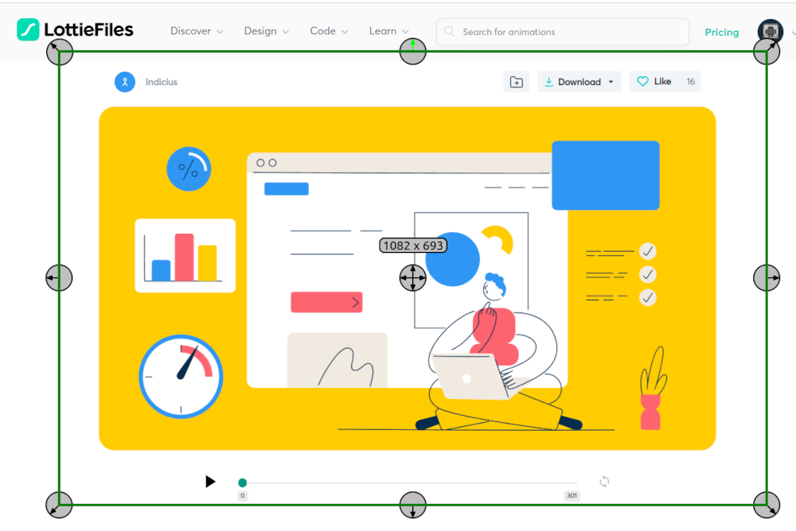
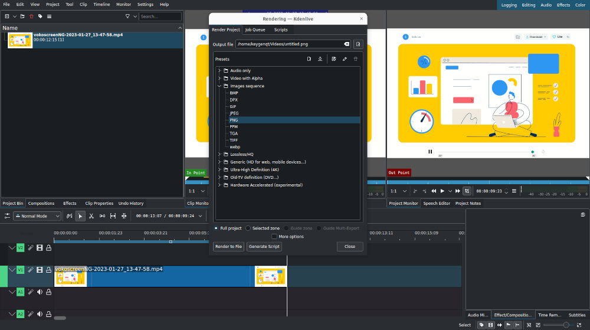
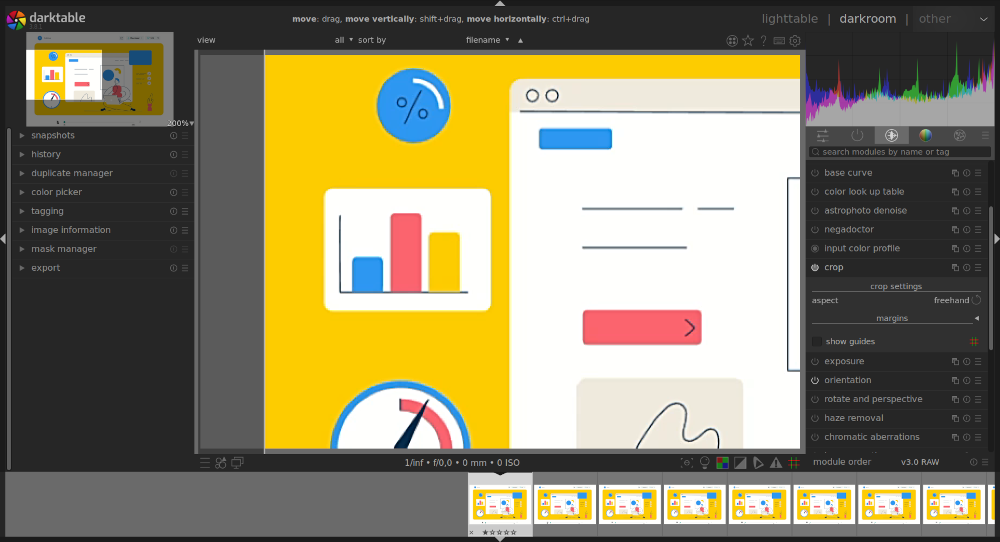
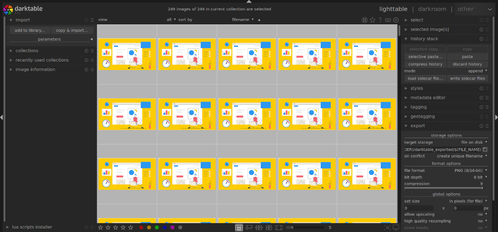
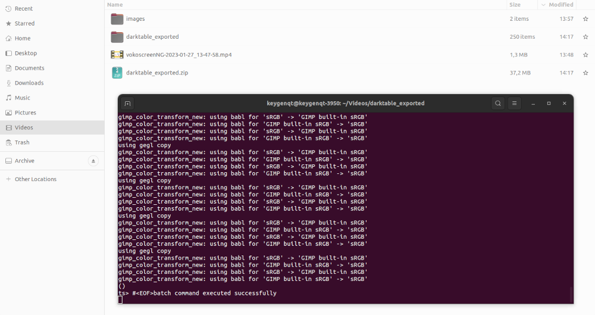
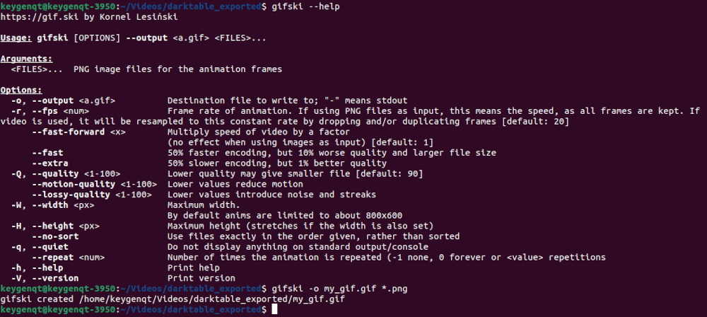

# Amazing Gif

Как можно украсить свой GitHub?
Или приложения на Aurora OS где пока нет Lottie?
Вы можете использовать для этого gif изображение.
Я продемонстрирую "простой" способ как можно собрать себе на операционной системе Linux симпатичный gif файл обойдя ограничения экспорта Lottie или как создать gif из видео файла.
Пример делаю на Ubuntu, в других Linux возможны небольшие отличия по установке.

Что нам понадобится

* [VokoscreenNG](https://linuxecke.volkoh.de/vokoscreen/vokoscreen.html)
* [Kdenlive](https://kdenlive.org/en/)
* [Darktable](https://www.darktable.org/)
* [Gimp](https://www.gimp.org/)
* [Gifski](https://gif.ski/)

VokoscreenNG, Kdenlive, Darktable, Gimp можно найти в apt или магазине приложений.
Gifski проще всего поставить через `Сargo`, подробнее [здесь](https://ubunlog.com/en/gifski-crear-imagenes-gif/?msclkid=1bcf1e8cce7011ec847112453e291ef2).
Все это бесплатно.

`VokoscreenNG` - мы можем записать с экрана все что нам нужно.
`Kdenlive` - мы можем подрезать видос и экспортировать png.
`Darktable` - мы можем подкрутить, пакетно, изображения.
`Gimp` - имеет <i>Batch Mode</i> мы можем подредактировать изображения с чем не справился Darktable.
Например, закруглить углы изображений.
`Gifski` - может собрать все эти картинки в gif с хорошим качеством изображения.

### VokoscreenNG

Допустим нам приглянулась анимация с Lottie.
Есть вариант скачать gif или mp4, но это не наш путь.
Обьясняю почему: размер не тот что нам нужно.
Белый background.
Если подкрутить bg на их сайте gif получаем рваные края.
Мы можем просто записать видео через VokoscreenNG нужного размера и качества.



### Kdenlive

Kdenlive открытый видеоредактор.
Подправим видео файл которые нам выдал VokoscreenNG.
Подрежим границы начала и конца.
Экспортируем видео в набор картинок с которыми мы будем работать дальше.
В Kdenlive есть экспорт gif, можете попробовать его, качество оставляет желать лучшего.



На выходе мы должны получить папку с изображениями с которыми можно продолжить работать.


### Darktable

Darktable приложения для фотографов.
Им можно серьезно поработать над изображениями.
Сейчас мы просто обрежем их до нужного нам размера.
Открываем папку с изображениями.
Находим crop и подрезаем первое изображение.



Далее нам нужно скопировать примененные модификации первого изображения на все остальные изображения.
Переходим в lighttable выбираем модифицированную картинку.
В разделе history stack жмем copy.
Выделяем все остальные (Ctrl+A) картинки и жмем paste.



В экспорте выбираем PNG и жмем export.

### Gimp

Теперь у нас почти готово, но радиуса на углах нет.
Darktable такого не умеет.
За то умеет Gimp.
В Gimp есть режим [Batch Mode](https://www.gimp.org/tutorials/Basic_Batch/) которые может подфиксить как нам нужно картинки.
В данном случает закруглить углы добавив прозрачность.
Сейчас там у нас белый цвет, который подойдет для GitHub пока юзер не переключит тему и их не увидит.
Для этого нам понадобится скрипт.
Вот этот закругляет на нужный радиус углы.

```bash
#!/bin/bash

echo -n "Specify radius: "

read radius

gimp -i -b - <<HERE
  (with-files "*.png"
    (let* ((imgwidth (car (gimp-image-width image)))
           (imgheight (car (gimp-image-height image)))
           (offsetx 0)
           (offsety 0)
           (radius $radius))
      (unless (= (car (gimp-image-base-type image)) INDEXED)
        (script-fu-round-corners image
                                 layer
                                 radius
                                 FALSE
                                 0
                                 0
                                 radius
                                 FALSE
                                 FALSE)
        (gimp-file-save RUN-NONINTERACTIVE
                        image
                        (car (gimp-image-merge-visible-layers image TRUE))
                        filename
                        filename))))
HERE
```

Запускаем его в терминале в папке с изображениями. Файлы будут перезаписаны, создайте бекап на всякий случай.



### Gifski

Теперь наши изображения максимально симпатичны.
Осталось собрать симпатичный gif файл.
С этим нам поможет Gifski.
С настройками можно ознакомится через --help.
Сейчас мы просто соберем gif файл c настройками по умолчанию.
В папке с подготовленными картинками выполним команду `gifski -o my_gif.gif *.png`.
Вот так это выглядит в терминале.



Вот и все.
Наш замечательный gif файл готов.
Теперь вы можете украсить им свою страничку на GitHub, свое приложение, и много чего другого!

Good luck!

