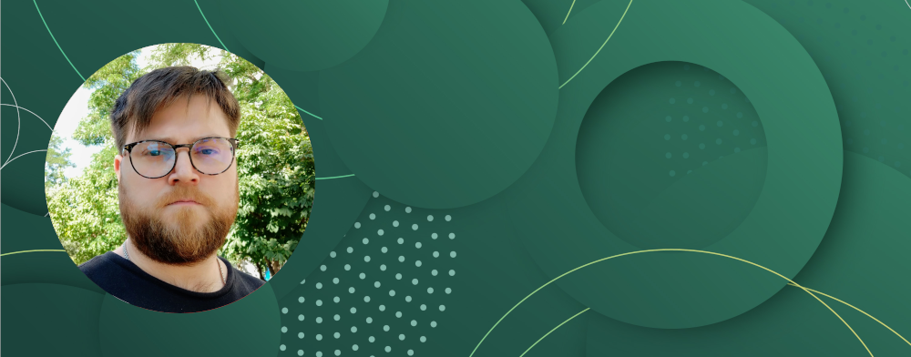

# Articles

Я не первый день пишу различные статьи. Те, которые я сделал с свободное время и не подходят под раздел [Boosty](../boosty/index.md), можно найти здесь. Без единого цента легко потерять информацию, что я с успехом делал уже ни раз. Единый центр всех публикаций, думаю, отличная идея: markdown, который подходит под mkdocs & obsidian, сайт, репозиторий проекты для статей - все можно найти в одном месте. Теперь ничего не потеряется, а статьи будут доступны всегда и всем.

> FYI. Так как это бекап статей, некоторые требуют обновлений и доработок, но по-прежнему, основная мысль в них присутствует.

