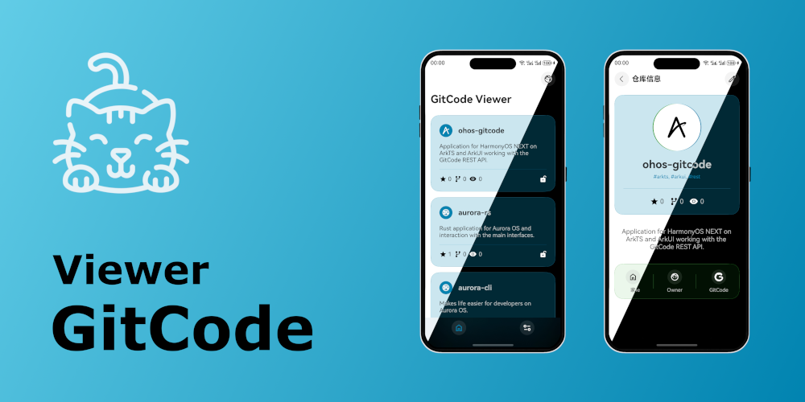
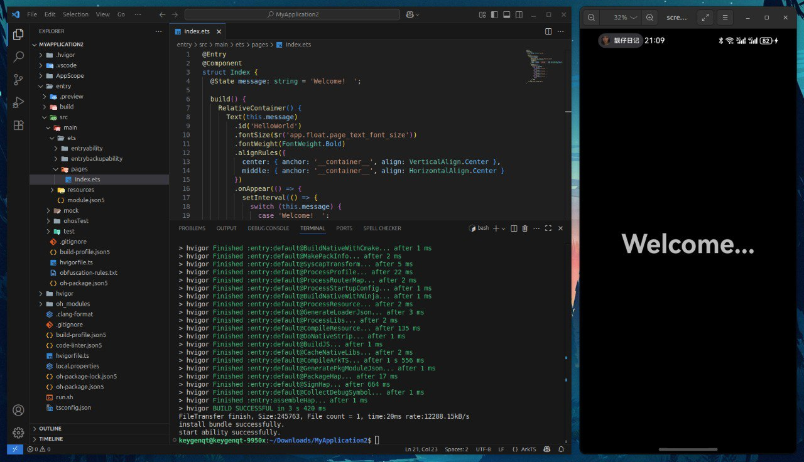
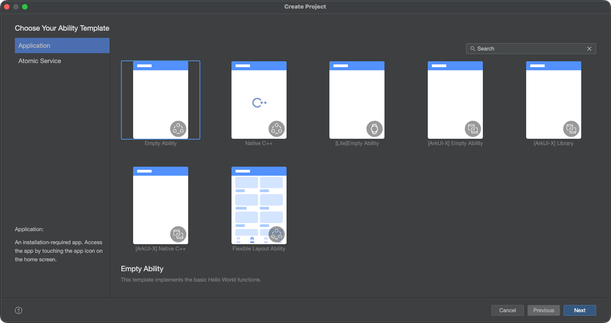
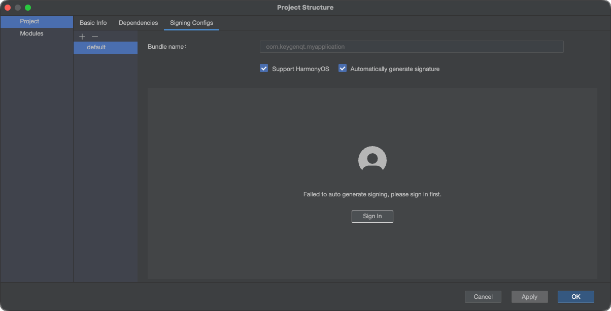
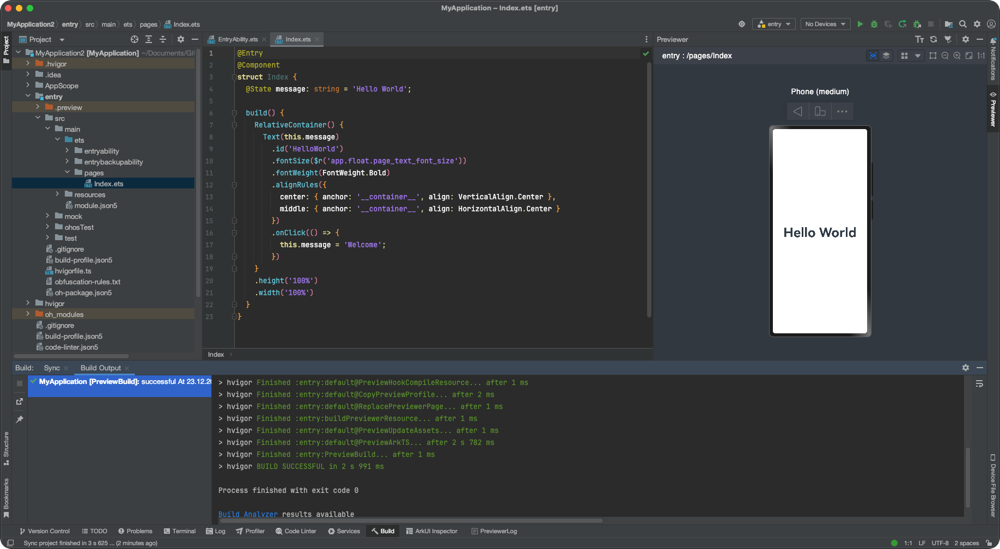
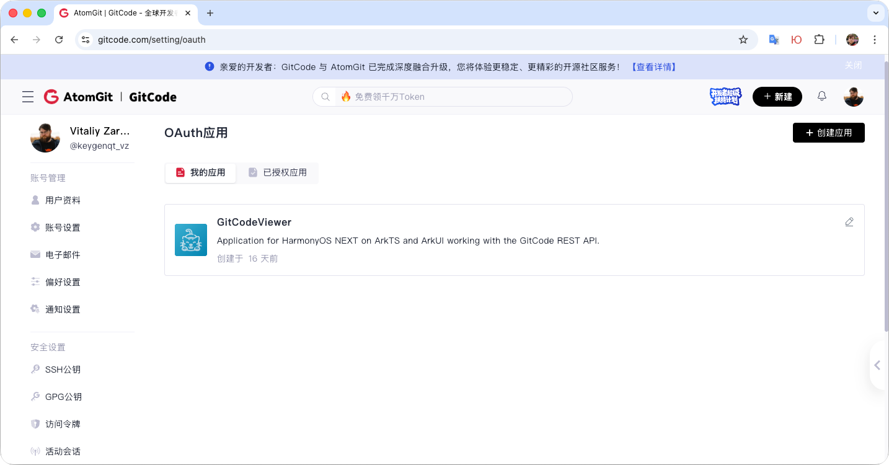

# Hello, HarmonyOS!

> 26-12-2025 <span class="github-link">[Материалы к статье :material-git:](https://gitcode.com/keygenqt_vz/ohos-gitcode)</span>



Привет! Я давно занимаюсь мобильной разработкой. Я писал на большом количестве языков и фреймворков для разных платформ и мне захотелось познакомиться с тем, что предлагает Huawei для разработчиков. Я написал небольшое, но функциональное приложение - GitCode Viewer, включив туда основной стек, необходимый для реализации типичного приложения. В статье опишу процесс и свои впечатления от ArkTS/ArkUI.

### IDE

Первым делом я зарегистрировался на HUAWEI Developers чтобы получить [DevEco Studio](https://developer.huawei.com/consumer/en/deveco-studio/). Просто зайти и скачать не выйдет - регистрация обязательна. Попав на страницу загрузки меня очень удивило отсутствие версии для Linux - основной ОС для моей работы. Если у вас нет другой ОС, можно работать и на Linux, установив [Command Line Tools](https://developer.huawei.com/consumer/en/doc/harmonyos-guides/ide-commandline-get) и плагин [ArkTS](https://github.com/ohosvscode/arkTS) в [Visual Studio Code](https://code.visualstudio.com/):



Но я решил не создавать себе сложности на ровном месте. Для меня ОС - не проблема. Я иногда пишу проекты под Windows и macOS (под Windows только если заставят). Поэтому просто поставил версию для macOS (aarch64) и... удивился во второй. Нет эмулятора. Вроде как он есть, но вычитал, что эмулятор доступен только в Азиатско-Тихоокеанском регионе. Не беда, у меня и на этот случай есть решение - я заблаговременно в Шанхае приобрел Mate 70 Pro с HarmonyOS NEXT на борту. Рассказывать как поставить IDE не буду, все стандартно.

### Wish list

Какое приложение можно написать чтобы попробовать максимальное количество концепций платформы, но при этом не сильно погружаясь в нюансы разработки и обеспечение инфраструктуры? Я недавно переехал с GitHub на GitCode и хотелось ближе познакомиться с этим сервисом. У GitCode есть [REST API](https://docs.gitcode.com/v1-docs/en/docs/guide/), которое можно использовать в приложении - HTTP запросы есть. Для GitCode OAuth нам нужно передать секретные ключи в приложение. OAuth я люблю делать через браузер - так пользователь получает максимальное юзабилити, для этого нам потребуется Deeplink. Для сохранения токена пользователя нам потребуется шифрование, сохранение данных, обфускация. У пользователей GitCode есть репозитории, а это список, пагинация, рефреш. Для изучения управления состояниями данных добавим страницу репозитория - обновляем страницу, меняются данные в списке. Еще лучше, когда есть редактирование данных, тогда состояния нужно передать уже по стеку вниз: `edit -> view -> list`, ну и еще это форма с полями, валидацией, и отправкой данных на сервер. Еще очень хотелось, чтобы в навигации были табы, я художник я так вижу.

Список желаний сформирован. Когда я его формировал я еще не знал что меня ждет, но надеялся на лучшее. Забегая наперед скажу, что мне удалось его полностью реализовать без особых проблем.

### Create

Открыв DevEco Studio, можно создать проект. Как я понимаю DevEco Studio - это форк JetBrains IDEA Community Edition, модифицированный под работу с ArkTS/ArkUI. В общем, обычная среда разработки с классическим интерфейсом. Я выбираю `Application -> Empty Ability` и двигаюсь дальше:



Заполнив конфигурацию проекта, получаем приложение "Hello, world!". Которое можно собрать, но вот запустить его на устройстве не получится. В файл `build-profile.json5` необходимо добавить `signingConfigs` - подпись сборки, для того, чтобы его можно было поставить на устройство. Дебаг это или нет - подпись необходима в любом случае. Получить ее несложно - заходим в `File -> Project Structure -> Signing Configs` и авторизируемся на HUAWEI еще разок:



После авторизации нам остается нажать OK и поле `signingConfigs` автоматически заполнится. После этого можно подключить устройство и нажать на привычную кнопку ▶ для запуска приложения на устройстве. Если у вас нет устройства, есть удобный режим просмотра:



> Не думаю, что произойдет что-то страшное, если вы закомитите дебажные ключи в git, но лучше этого не делать. В файле `build-profile.json5` находится много разных настроек и в `.gitignore` их не убрать. Я не стал с этим ничего делать, но вообще починить это можно через плагины [hvigor](https://developer.huawei.com/consumer/en/doc/harmonyos-guides/ide-hvigor).

### Structure

Давайте посмотрим из чего состоит шаблон приложения. Вот такой набор файлов я получил, создав проект из шаблона `Empty Ability`:

```shell
.
├── AppScope
│   ├── app.json5
│   └── resources
│       └── base
│           ├── element
│           │   └── string.json
│           └── media
│               ├── background.png
│               ├── foreground.png
│               └── layered_image.json
├── build-profile.json5
├── code-linter.json5
├── entry
│   ├── build-profile.json5
│   ├── hvigorfile.ts
│   ├── obfuscation-rules.txt
│   ├── oh-package.json5
│   └── src
│       ├── main
│       │   ├── ets
│       │   │   ├── entryability
│       │   │   │   └── EntryAbility.ets
│       │   │   ├── entrybackupability
│       │   │   │   └── EntryBackupAbility.ets
│       │   │   └── pages
│       │   │       └── Index.ets
│       │   ├── module.json5
│       │   └── resources
│       │       ├── base
│       │       │   ├── element
│       │       │   │   ├── color.json
│       │       │   │   ├── float.json
│       │       │   │   └── string.json
│       │       │   ├── media
│       │       │   │   ├── background.png
│       │       │   │   ├── foreground.png
│       │       │   │   ├── layered_image.json
│       │       │   │   └── startIcon.png
│       │       │   └── profile
│       │       │       ├── backup_config.json
│       │       │       └── main_pages.json
│       │       ├── dark
│       │       │   └── element
│       │       │       └── color.json
│       │       └── rawfile
│       ├── mock
│       │   └── mock-config.json5
│       ├── ohosTest
│       │   ├── ets
│       │   │   └── test
│       │   │       ├── Ability.test.ets
│       │   │       └── List.test.ets
│       │   └── module.json5
│       └── test
│           ├── List.test.ets
│           └── LocalUnit.test.ets
├── hvigor
│   └── hvigor-config.json5
├── hvigorfile.ts
├── local.properties
├── oh-package-lock.json5
└── oh-package.json5
```

[JSON5](https://json5.org/) - это расширение формата файлов JSON. Удобен для конфигураций: в нем можно оставлять комментарии, добавлять запятую в конце массива, и другие удобства.

Приложение разделено на: "root", "AppScope", "entry". В корне проекта находятся глобальные конфигурации проекта. В `AppScope` находится иконка приложения, его название и основная информация: `bundleName`, `versionCode` и т.д. entry - основной модуль приложения, при желании таких модулей может быть много.

Директория hvigor с файлом `hvigor-config.json5` отвечает за настройку сборки. Hvigor — это система сборки HarmonyOS, основанная на концепции улучшенной замены Gradle, построенной на TypeScript. Она не прибита гвоздями к IDE, доступна в Command Line Tools, поэтому организовать CI/CD не будет проблемой. Файлы `hvigorfile.ts` позволяют доработать сборку под себя через плагины и выполнить задачи, которые должны быть сделаны до и после сборки.

Профили сборки настраиваются в файлах `build-profile.json5`. Они позволяют гибко настроить сборку под разные задачи: тестирование, релиз, дебаг, и т.д.

Зависимости добавляются в файлы `oh-package.json5`, как на уровне модуля, так и на уровне проекта. Пакеты для ваших проектов можно найти здесь: [OpenHarmony Third-Party Library Repository](https://ohpm.openharmony.cn/#/en/home).

Еще из важных конфигурационных файлов это: `code-linter.json5` и `obfuscation-rules.txt`. Linter - отвечает за статический анализ исходного кода - автоматически проверяет его на наличие ошибок, несоответствие стилю и «плохие» практики программирования, выступая в роли автоматического ревьюера и редактора кода, помогая писать более качественный, чистый и единообразный код. Obfuscation - преобразует программный код в запутанную, трудночитаемую форму, которая сохраняет исходную функциональность программы, но делает ее анализ, понимание и модификацию чрезвычайно сложными для людей и автоматизированных инструментов.

Код приложения и его ресурсы находятся в `entry->src->main`. `EntryAbility.ets` - точка входа в приложение. В файле `EntryBackupAbility.ets` можно настроить миграцию данных приложения. `Index.ets` - страница приложения, которую можно переназначить в `EntryAbility.ets`.

Ресурсы приложения: тексты приложения, их локализация, изображения, цвета для светлой и темной темы, и другие данные находятся в директории `resources`. Каждый модуль может содержать свой набор ресурсов, а также можно разместить глобальные ресурсы в директории `AppScope`, которые будут доступны из всех модулей.

По мне, так все просто, удобно и продуманно. Есть все нужное для написания приложения. Давайте приступим.

### Navigation

Для начала нужно разобраться с навигацией по страницам. Я хотел табы на главной. Компонент [Tabs](https://developer.huawei.com/consumer/en/doc/harmonyos-references/ts-container-tabs) позволяет их реализовать:

```ts
Tabs({ barPosition: BarPosition.End }) {
  TabContent() {
	// Page 1
  }.tabBar(customTabBar({ icon: $r('app.media.icon_home'), active: this.tab === 0 }))

  TabContent() {
    // Page 2
  }.tabBar(customTabBar({ icon: $r('app.media.icon_page_info'), active: this.tab === 1 }))
}
.onSelected((index: number) => {
  this.tab = index;
})
.height('100%')
.width('100%')
.backgroundColor($r('sys.color.background_primary'))
.barBackgroundColor(Color.Transparent)
.barOverlap(true)
```

Контролировать состояния на странице можно через `@State`. Переменная `this.tab` добавлена так:

```ts
@State page: number = 1;
```

Функция `customTabBar` модифицирует табы, чтобы дизайнер был доволен. Какие попало функции в стеке UI вызывать нельзя. Только те, что отмечены аннотацией `@Builder`:

```ts
@Builder
export function customTabBar(params: CustomTabBarParams) {
  Button({ type: ButtonType.Circle }) {
    Image(params.icon)
      .fillColor(params.active ? $r('app.color.primary') : $r('app.color.btn_round_icon_fill'))
      .width(24)
      .height(24)
  }.width(40).height(40).backgroundColor($r('app.color.btn_round_background'))
}
```

`CustomTabBarParams` - класс параметров. Следует учесть что при создании своих функций параметры, переданные без класса, не будут обновляться после изменения состояния в родительском компоненте, а используя класс - обновления произойдут. Выглядит он так:

```ts
class CustomTabBarParams {
  icon: ResourceStr | null = null;
  active: boolean = false;
}
```

В `TabContent` мы можем поместить наши страницы. У меня в табах две страницы - главная с навигацией и страница "settings/about". Со второй страницей все просто, а вот на главную ляжет вся нагрузка по навигации. Компонент [Navigation](https://developer.huawei.com/consumer/en/doc/harmonyos-references/ts-basic-components-navigation) позволяет реализовать перемещение по страницам:

```ts
@Provide('navStack') navStack: NavPathStack = new NavPathStack()

build() {
	Tabs({ barPosition: BarPosition.End }) {
	  TabContent() {
	    Navigation(this.navStack) {
	      // tabRepos
	    }
	    .title($r('app.string.app_name'))
	    .mode(NavigationMode.Stack)
	    .navDestination(navDestination)
	  }.tabBar(customTabBar({ icon: $r('app.media.icon_home'), active: this.tab === 0 }))

	  TabContent() {
	    // tabAbout
	  }.tabBar(customTabBar({ icon: $r('app.media.icon_page_info'), active: this.tab === 1 }))
	}
	.onSelected((index: number) => {
	  this.tab = index;
	})
	.height('100%')
	.width('100%')
	.backgroundColor($r('sys.color.background_primary'))
	.barBackgroundColor(Color.Transparent)
	.barOverlap(true)
}
```

Но он ничего не знает о табах. То есть, наша главная страница находится в табе и при переходе на страницу по стеку таб останется на месте, чего бы мне не хотелось. Но это можно исправить:

```ts
build() {
	Tabs({ barPosition: BarPosition.End }) {
	  TabContent() {
	    Navigation(this.navStack) {
	      // tabRepos
	    }
	    .title($r('app.string.app_name'))
	    .mode(NavigationMode.Stack)
	    .navDestination(navDestination)
	  }.tabBar(customTabBar({ icon: $r('app.media.icon_home'), active: this.tab === 0 }))

	  TabContent() {
	    // tabAbout
	  }.tabBar(customTabBar({ icon: $r('app.media.icon_page_info'), active: this.tab === 1 }))
	}
	.onSelected((index: number) => {
	  this.tab = index;
	})
	.height('100%')
	.width('100%')
	.backgroundColor($r('sys.color.background_primary'))
	.barBackgroundColor(Color.Transparent)
	.barOverlap(true)
	// Change the height when the stack size changes
	.barHeight(this.navStack.size() === 0 ? null : 0.01)
	// Let's disable swipe
	.scrollable(false)
	// Let's add a height change animation
	.animation({
	  duration: 200,
	  iterations: 1,
	  curve: Curve.Linear,
	  playMode: PlayMode.Normal
	})
}
```

Теперь когда мы будем с главной переходить по стеку страниц, таб будет симпатично "сворачиваться" и отображаться будет только на главной, где в моем приложении находится список репозиториев GitCode. Перейти со страницы по стеку можно так:

```ts
this.navStack?.pushPath({ name: Pages.repo });
```

`Pages` - константы, названия страниц. [NavPathStack](https://developer.huawei.com/consumer/en/doc/harmonyos-references/ts-basic-components-navigation#navpathstack10) позволяет осуществлять переходы, передавать данные, все что нужно для навигации. Компоненту Navigation необходимо указать логику перемещения в функции `navDestination`. У меня эта функция выглядит так:

```ts
@Builder
export function navDestination(name: string, param: string) {
  if (name === Pages.repo) {
    PageRepo();
  } else if (name === Pages.repo_update) {
    PageRepoUpdate();
  } else if (name === Pages.user) {
    PageUser();
  } else {
    PageNotFound();
  }
}
```

Когда мы вызываем метод перехода в навигации, мы попадаем в эту функцию. Обрабатываем входящие параметры, если необходимо, и переходим на нужную нам страницу. Вложенные страницы навигации получают доступ к навигации так:

```ts
@Consume('navStack') navStack: NavPathStack;

build() {
  NavDestination() {
    // Body page
  }.title($r('app.string.PageRepoUpdate_title')).onBackPressed(() => {
    this.navStack.pop();
    return true;
  })
}
```

Масштабируя это, можно получить нужную вам навигацию. Передача аргументов через навигацию фиксирует значения, у меня в приложении данные обновляются на каждой странице, для их обновления вверх по стеку я использовал глобальное хранилище состояния пользовательского интерфейса.

### AppStorage & PersistentStorage

[AppStorage](https://developer.huawei.com/consumer/en/doc/harmonyos-guides/arkts-appstorage#storagelink) - позволяет использовать данные, глобально меняя их состояние. Например, список репозиториев находится в AppStorage, мы перешли в редактирование какого-то репозитория, обновили его и можем получить доступ к списку, изменив в нем данные. Вернувшись по стеку назад, список будет обновлен.

[PersistentStorage](https://developer.huawei.com/consumer/en/doc/harmonyos-guides/arkts-persiststorage) - это дополнение к AppStorage, которое позволяет сохранить данные локально. Это не база данных, использование его не предполагает больших нагрузок, но для сохранения токена или других мелких данных он вполне сгодится.

Для того, чтобы добавить AppStorage в компонент вместо `@State` используйте `@StorageLink`:

```ts
@StorageLink(Storage.repoData) repoData: RepoModel | null = null;
@StorageLink(Storage.reposData) reposData: [RepoModel] | null = null;
```

Здесь `Storage` - константы с названиями, а `RepoModel` - модель данных, которую позже мы получим при запросе к API GitCode. Так можно добавить AppStorage на любую страницу, где они вам понадобятся и менять их состояние одновременно на всех страницах.

Для того, чтобы сохранить данные нам нужно просто инициализировать PersistentStorage. В приложении я сохраняю данные пользователя и данные авторизации:

```ts
PersistentStorage.persistProp(Storage.authData, null);
PersistentStorage.persistProp(Storage.userData, null);
```

Важно учитывать что инициализировать PersistentStorage нужно не где попало, а на главной странице. Но данные авторизации хранить в незашифрованном виде нельзя. Давайте зашифруем их.

###  Obfuscation & Crypto

По умолчанию обфускация отключена, активировать ее можно в файле `build-profile.json5`:

```json5
"buildOptionSet": [
  {
    "name": "release",
    "arkOptions": {
      "obfuscation": {
        "ruleOptions": {
          "enable": true,
          "files": [
            "./obfuscation-rules.txt"
          ]
        }
      }
    }
  },
],
```

Файл `obfuscation-rules.txt` позволяет настроить [обфускацию](https://developer.huawei.com/consumer/en/doc/harmonyos-guides-V5/source-obfuscation-V5). Это снижает риск взлома приложения, и получения секретных ключей, которые используются в приложении. Нам понадобится такой ключ для шифрования данных, которые будут помещены в PersistentStorage.

Для шифрования данных мы можем воспользоваться пакетом `@ohos/crypto-js`. Для этого обновим зависимости в файл `oh-package.json5`:

```json5
{
  "name": "entry",
  "version": "0.0.1",
  "description": "Application for HarmonyOS on ArkTS and ArkUI working with the GitCode REST API.",
  "main": "",
  "author": "Vitaliy Zarubin <keygenqt@yandex.ru",
  "license": "Apache-2.0",
  "dependencies": {
    "@ohos/crypto-js": "2.0.5"
  }
}
```

Добавим пару функций, с помощью которых мы будем шифровать данные:

```ts
import { CryptoJS } from '@ohos/crypto-js'
import BuildProfile from 'BuildProfile';

export function encryptData(data: string) {
  return CryptoJS.AES.encrypt(data, BuildProfile.cryptoSecret).toString();
}

export function decryptData(encryptedData: string) {
  return CryptoJS.AES.decrypt(encryptedData, BuildProfile.cryptoSecret).toString(CryptoJS.enc.Utf8);
}
```

И для удобства добавим сохранение и получение данных с шифрованием для `AuthModel`:

```ts
import { Storage } from '../constants';
import { decryptData, encryptData } from '../utils/crypto';
import { AuthModel } from './AuthModel';

export function saveAuthModel(model: AuthModel) {
  AppStorage.setOrCreate(Storage.authData, encryptData(JSON.stringify(model)));
}

export function getAuthModel(): AuthModel | undefined {
  const data = AppStorage.get<string>(Storage.authData);
  if (!data) return undefined;
  return JSON.parse(decryptData(data));
}
```

Теперь мы можем быть уверены, что данные зашифрованы и их никто не получит. Но где взять `BuildProfile.cryptoSecret`?

### BuildProfile & Plugin Hvigor

[BuildProfile](https://developer.huawei.com/consumer/en/doc/harmonyos-guides/ide-hvigor-get-build-profile-para-guide) позволяет передать в приложения переменные из параметров сборки:

```ts
/**
 * Use these variables when you tailor your ArkTS code. They must be of the const type.
 */
export const BUNDLE_NAME = 'com.keygenqt.gitcode';
export const BUNDLE_TYPE = 'app';
export const VERSION_CODE = 1000000;
export const VERSION_NAME = '0.0.1';
export const TARGET_NAME = 'default';
export const PRODUCT_NAME = 'default';
export const BUILD_MODE_NAME = 'debug';
export const DEBUG = true;

/**
 * BuildProfile Class is used only for compatibility purposes.
 */
export default class BuildProfile {
  static readonly BUNDLE_NAME = BUNDLE_NAME;
  static readonly BUNDLE_TYPE = BUNDLE_TYPE;
  static readonly VERSION_CODE = VERSION_CODE;
  static readonly VERSION_NAME = VERSION_NAME;
  static readonly TARGET_NAME = TARGET_NAME;
  static readonly PRODUCT_NAME = PRODUCT_NAME;
  static readonly BUILD_MODE_NAME = BUILD_MODE_NAME;
  static readonly DEBUG = DEBUG;
}
```

Мы можем добавить пользовательские поля через `buildProfileFields` в файле `build-profile.json5` для доступа к ним во время выполнения. Они будут обфусцированы, думаю, вполне надежно, чтобы сохранить наш секретный ключ (если вы знаете лучше способ - прошу в комментарии).

Я добавил 3 поля: `clientId`, `clientSecret`, `cryptoSecret`. Первые два получаешь при регистрации приложения на GitCode, `cryptoSecret` - ключ для шифрования данных:

```json5
"products": [
  {
    "name": "default",
    "signingConfig": "default",
    "targetSdkVersion": "5.1.1(19)",
    "compatibleSdkVersion": "5.1.1(19)",
    "runtimeOS": "HarmonyOS",
    "buildOption": {
      "strictMode": {
        "caseSensitiveCheck": true,
        "useNormalizedOHMUrl": true
      },
      "arkOptions": {
        "buildProfileFields": {
          "clientId": "***",
          "clientSecret": "***",
          "cryptoSecret": "***",
        }
      }
    },
  }
]
```

Поместить секретные ключи напрямую в файл `build-profile.json5` - не самая хорошая идея: они очень быстро окажутся в истории git. Для того, чтобы этого не произошло мы можем написать плагин для Hvigor, который прочтет файл, находящийся в `.gitignore`, и установит значения при сборке. В файле `hvigorfile.ts` добавим плагин:

```ts
import { appTasks, OhosPluginId } from '@ohos/hvigor-ohos-plugin';
import { hvigor, HvigorNode, HvigorPlugin } from '@ohos/hvigor';

function localSecretPlugin(): HvigorPlugin {
  return {
    pluginId: 'localSecretPlugin',
    apply(node: HvigorNode) {
      hvigor.getRootNode().afterNodeEvaluate(root => {
        const fs = require('fs');
        const config = './local.secret.json5';
        if (fs.existsSync(config)) {
          const data = fs.readFileSync(config, 'utf-8');
          const secret = JSON.parse(data);
          const appCtx = root.getContext(OhosPluginId.OHOS_APP_PLUGIN) as OhosAppContext;
          const buildProfile = appCtx.getBuildProfileOpt();
          (buildProfile.app.products || []).forEach((prd: any) => {
            prd.buildOption.arkOptions.buildProfileFields.clientId = secret.clientId;
            prd.buildOption.arkOptions.buildProfileFields.clientSecret = secret.clientSecret;
            prd.buildOption.arkOptions.buildProfileFields.cryptoSecret = secret.cryptoSecret;
          });
          appCtx.setBuildProfileOpt(buildProfile);
        } else {
          console.warn(`> Not found file '${config}'`)
        }
      });
    }
  }}

export default {
  system: appTasks, plugins: [localSecretPlugin()]
}
```

Он прочет файл `local.secret.json5`, который мы добавим в `.gitignore` и установит нужные значения.

```json5
{
  "clientId": "vyxtzcgg4i4aivmiua9eom71qkao1jp4t6e2",
  "clientSecret": "eivbesrcri8w71zm0tmtskdck0u0czj83dfo",
  "cryptoSecret": "vtl3q9dkl0zgxerp9obol1gym9clitbo5s0n"
}
```

После сборки BuildProfile приобретет вид:

```ts
/**
 * Use these variables when you tailor your ArkTS code. They must be of the const type.
 */
export const BUNDLE_NAME = 'com.keygenqt.gitcode';
export const BUNDLE_TYPE = 'app';
export const VERSION_CODE = 1000000;
export const VERSION_NAME = '0.0.1';
export const TARGET_NAME = 'default';
export const PRODUCT_NAME = 'default';
export const BUILD_MODE_NAME = 'debug';
export const DEBUG = true;
export const clientId = 'vyxtzcgg4i4aivmiua9eom71qkao1jp4t6e2';
export const clientSecret = 'eivbesrcri8w71zm0tmtskdck0u0czj83dfo';
export const cryptoSecret = 'vtl3q9dkl0zgxerp9obol1gym9clitbo5s0n';

/**
 * BuildProfile Class is used only for compatibility purposes.
 */
export default class BuildProfile {
  static readonly BUNDLE_NAME = BUNDLE_NAME;
  static readonly BUNDLE_TYPE = BUNDLE_TYPE;
  static readonly VERSION_CODE = VERSION_CODE;
  static readonly VERSION_NAME = VERSION_NAME;
  static readonly TARGET_NAME = TARGET_NAME;
  static readonly PRODUCT_NAME = PRODUCT_NAME;
  static readonly BUILD_MODE_NAME = BUILD_MODE_NAME;
  static readonly DEBUG = DEBUG;
  static readonly clientId = clientId;
  static readonly clientSecret = clientSecret;
  static readonly cryptoSecret = cryptoSecret;
}
```

Поля `clientId` и `clientSecret` необходимы для выполнения запросов с авторизацией в GitCode [REST API](https://docs.gitcode.com/v1-docs/en/docs/guide/). Получить их можно, создав приложение OAuth GitCode.

### OAuth GitCode

Для авторизации запросов в API GitCode необходимо в настройках вашего профиля GitCode создать приложение:



В соседней вкладке вы можете найти приложения, на которые вы подписались - там можно отключить подписку при желании. Настройки там простые, но есть одно важное поле - ссылка для редиректа (应用回调地址). Для регистрации в приложении мы направляем пользователя на страницу авторизации, после успешной авторизации GitCode перенаправит пользователя на страницу редиректа с данными, которую должно обработать приложение.

Обработать такой редирект приложением можно двумя способами: WebView или Deeplink. WebView - способ для бедных. Он прост, а главный минус его в том, что пользователю всегда нужно будет проходить авторизацию на ресурсе. Внешний браузер имеет сохранения и пользователь уже может быть авторизован на ресурсе, ему не придется каждый раз вводить логин и пароль. Мой выбор - Deeplink и внешний браузер.

### Deeplink

Для того, чтобы добавить Deeplink нам нужен сайт, который перенаправит пользователя в приложение из браузера. Я не буду учить писать сайты, достаточно простенькой HTML страницы, которая будет будет перенаправлять уже под Deeplink. Сам GitCode не позволит указать вам Deeplink в поле редиректа:

```html
<!DOCTYPE html>
<html>
<head>
	<meta name="viewport" content="width=device-width, initial-scale=1" />
	<title>Welcome!</title>
	<style>
		/* ... */
	</style>
</head>
<body onload="doOpenLink()">
	<table class="Root-Table">
		<tr class="Root-Tr">
			<td class="Root-Td">
				<div class="Box">
					<h1> Welcome! </h1>
					<div class="Icon">
						
					</div>
					<div style="margin-bottom: 30px;">
						Authorization was successful, to complete it, go to the application.
					</div>
					<div onclick="doOpenLink()" class="Link">
						Go to the application
					</div>
				</div>
			</td>
		</tr>
	</table>
</body>
</html>

<script>
	function doOpenLink() {
		window.location.href = "link://ohos-gitcode.keygenqt.com" + window.location.search
	}
</script>
```

Deeplink на странице это `link://ohos-gitcode.keygenqt.com`, перенаправление происходит автоматически, а также пользователь может перейти по нажатию кнопки, если проигнорировал автоматическое перенаправление. Для добавления Deeplink в приложение в файле `module.json5` укажем что мы хотим открывать host `ohos-gitcode.keygenqt.com`:

```json5
{
//...
"abilities": [
  {
    "name": "EntryAbility",
    "srcEntry": "./ets/entryability/EntryAbility.ets",
    "description": "$string:EntryAbility_desc",
    "icon": "$media:layered_image",
    "label": "$string:EntryAbility_label",
    "startWindowIcon": "$media:layered_start_icon",
    "startWindowBackground": "$color:start_window_background",
    "exported": true,
    "skills": [
      {
        "entities": [
          "entity.system.home"
        ],
        "actions": [
          "ohos.want.action.home",
          "ohos.want.action.viewData",
          "ohos.want.action.sendToData"
        ],
        "uris": [
          {
            "scheme": "link",
            "host": "ohos-gitcode.keygenqt.com"
          }
        ]
      }
    ]
  }
]
//...
}
```

После этого при попытке открыть Deeplink `link://ohos-gitcode.keygenqt.com` будет предложено наше приложение. А принять перенаправление можно в классе `EntryAbility` в методе `onNewWant`:

```ts
export default class EntryAbility extends UIAbility {
	// ...
  onNewWant(want: Want, launchParam: AbilityConstant.LaunchParam) {
    let uri = want?.uri;
    if (uri && uri.includes("ohos-gitcode.keygenqt.com")) {
      let urlObject = url.URL.parseURL(want?.uri);
      let code = urlObject.params.get('code');
      // Auth user by code...
    }
  }
  // ...
}
```

GitCode перенаправляет на сайт, указанный для редиректа. Сайт откроет Deeplink c кодом авторизации из редиректа. Получив его, можно выполнить запрос и получить токены, с помощью которых уже можно будет обращаться к API. Давайте сделаем запрос и получим данные авторизации.

### HTTP request

Для запросов я использовал пакет `@ohos/axios` - библиотека для обработки сетевых запросов. Для выполнения запросов нужно добавить права доступа для этого в `module.json5`:

```json5
{
  "module": {
	  // ...
    "requestPermissions": [
      {
        "name": "ohos.permission.INTERNET",
        "reason": "$string:reason_permission_internet",
        "usedScene": {
          "abilities": ["EntryAbility"],
          "when": "always"
        }
      }
    ]
    // ...
  }
}
```

Теперь можно закончить авторизацию в методе `onNewWant`:

```ts
export default class EntryAbility extends UIAbility {
	// ...
  onNewWant(want: Want, launchParam: AbilityConstant.LaunchParam) {
    let uri = want?.uri;
    if (uri && uri.includes("ohos-gitcode.keygenqt.com")) {
      let urlObject = url.URL.parseURL(want?.uri);
      let code = urlObject.params.get('code');
      // Auth by code
      axios.post<AuthModel, AxiosResponse<AuthModel>, null>(Links.auth_token(code))
        .then((response: AxiosResponse<AuthModel>) => {
          // Save auth data
          saveAuthModel(response.data);
          // Get user data
          axios.get<UserModel, AxiosResponse<UserModel>, null>(Links.user())
            .then((response: AxiosResponse<UserModel>) => {
              // Save user data
              saveUserModel(response.data);
            })
            .catch((_: AxiosError) => AppStorage.delete(Storage.userData))
        })
        .catch((_: AxiosError) => AppStorage.delete(Storage.authCode))
    }
  }
  // ...
}
```

Здесь мы выполняем POST-запрос для получения токенов. Ссылки я формирую в методах класса `Links`:

```ts
export class Links {
  static auth_token(code: string | null) {
    return `https://gitcode.com/oauth/token?grant_type=authorization_code&code=${code}&client_id=${BuildProfile.clientId}&client_secret=${BuildProfile.clientSecret}`;
  }

  static user(): string {
    const link = `https://api.gitcode.com/api/v5/user?access_token=${getAuthModel()?.access_token}`;
    console.debug(link)
    return link
  }
}
```

`axios` принимает интерфейс модели и при успешном выполнении возвращает модель:

```ts
export interface AuthModel {
  access_token: string,
  expires_in: number,
  refresh_token: string,
  scope: string,
  created_at: string,
}
```

Мы сохраняем модель авторизации с шифрованием и выполняем запрос получения данных пользователя. Получив все необходимые данные и сохранив их в AppStorage, на странице с `@StorageLink` меняется состояние данных и мы можем отреагировать на это изменением состояния страницы.

> Пакет `axios` работает отлично, он удобен, но я обнаружил одну неприятность... Он не умеет `PATCH` ([issues/361](https://gitcode.com/openharmony-sig/ohos_axios/issues/361)). Нечасто я в REST API вижу методы `PATCH`, но в GitCode он был. Для одного запроса - сохранение настроек, я использовал [rcp](https://developer.huawei.com/consumer/cn/doc/harmonyos-references/remote-communication-rcp#section20787153164810), чтобы его выполнить. Надеюсь, вопрос этот решат в `axios`.

Для контроля состояний страницы я написал компонент, который решает вопрос дублирования кода на каждой странице - `PageBodyState`.

### Page State

На каждой странице есть запросы в сеть для получения свежих данных. Запрос может быть как успешен, так и нет, срок работы токена может закончиться, есть ожидание ответа на странице. Для всех этих задач я сделал компонент, который един для всех страниц и отображает все необходимые состояния:

```ts
import lottie from '@ohos/lottie';
import { PageState } from "../enums"
import { common } from '@kit.AbilityKit';
import { Links, Storage } from '../constants';
import { UserModel } from '../models';

@Component
export struct PageBodyState {
  @Require
  @Prop  state: PageState | object | null;

  @Require
  @BuilderParam content: () => void

  @StorageLink(Storage.authCode) authCode: boolean = false;
  @StorageLink(Storage.userData) userData: UserModel | null = null;

  stateAuth: () => void = () => {}
  stateAuthLoading: () => void = () => {}
  stateLoading: () => void = () => {}
  stateError: () => void = () => {}

  build() {
    if (!this.authCode && this.userData === null) {
      Column() {
        this.bodyAuth()
      }
      .width('100%')
      .height('100%')
      .onAttach(() => {
        this.state = PageState.Loading
        this.stateAuth()
      })
    }
    else if (this.authCode && this.userData === null) {
      Column() {
        this.bodyLoading()
      }
      .width('100%')
      .height('100%')
      .onAttach(this.stateAuthLoading)
    }
    else if (this.state === PageState.Loading) {
      Column() {
        this.bodyLoading()
      }
      .width('100%')
      .height('100%')
      .onAttach(this.stateLoading)
    }
    else if (this.state === PageState.Error) {
      Column() {
        this.bodyError()
      }
      .width('100%')
      .height('100%')
      .onAttach(this.stateError)
    } else {
      Column() {
        this.content()
      }
      .width('100%')
      .height('100%')
    }
  }

  @Builder
  bodyAuth() {
    // Body auth
  }

  @Builder
  bodyLoading() {
    // Body loading
  }

  @Builder
  bodyError() {
     // Body error
  }
}
```

Компонент тоже может слушать состояния данных в AppStorage и отображать нужный контент. Также мы можем управлять состояниями со страницы, применяя `PageBodyState` на ней:

```ts
import axios, { AxiosError, AxiosResponse } from "@ohos/axios";
import { common } from '@kit.AbilityKit';
import { PageBodyState } from "../../base/components";
import { Links, Storage } from "../../base/constants";
import { PageState } from "../../base/enums";
import { UserModel } from "../../base/models";

@Component
export struct PageUser {
  @Consume('navStack') navStack: NavPathStack;

  @StorageLink(Storage.userData) userData: UserModel | null = null;

  @State pageState: PageState = PageState.Loading;

  build() {
    NavDestination() {
      PageBodyState({state: this.pageState, stateLoading: () => {
        this.queryModel()
      }}) {
        this.bodyModel()
      }
    }
    .title($r('app.string.PageUser_title'))
    .onBackPressed(() => this.navStack.pop() !== undefined)
  }

  queryModel() {
    axios.get<UserModel, AxiosResponse<UserModel>, null>(Links.user())
      .then((response: AxiosResponse<UserModel>) => {
        this.userData = response.data
        this.pageState = PageState.Ready
      })
      .catch((_: AxiosError) => this.pageState = PageState.Error);
  }

  @Builder
  bodyModel() {
    Refresh({ refreshing: this.pageState == PageState.Refresh }) {
      Scroll() {
        // Body content
      }
    }
    .height('100%')
    .onStateChange((refreshStatus: RefreshStatus) => {
      if (refreshStatus == RefreshStatus.Refresh) {
        this.pageState = PageState.Refresh
        this.queryModel()
      }
    })
    .refreshOffset(64)
    .pullToRefresh(true)
  }
}
```

Открывая страницу `PageUser`, мы начинаем с состояния `PageState.Loading`, `PageBodyState` вызывает метод `stateLoading` и выполняется запрос на получение данных пользователя. В зависимости от результата мы устанавливаем состояние в `PageState.Ready` или `PageState.Error`. Компонент ArkUI [Refresh](https://developer.huawei.com/consumer/en/doc/harmonyos-references/ts-container-refresh) позволяет обновить страницу без изменения глобального состояния, для этого есть `PageState.Refresh`. Так мы убираем дублирование кода и стандартизируем подход к состояниям страницы одним компонентом.

> Обратите внимание на обновление данных `this.userData = response.data` после успешного запроса - они обновятся по всему приложению.

Теперь у нас есть все базовые блоки для развития приложения. Все компоненты ArkUI можно найти в [документации](https://developer.huawei.com/consumer/en/doc/harmonyos-references/arkui-declarative-comp) - достаточно подробной и с примерами.

### Done

Я не описывал все приложение, оно [доступно на GitCode](https://gitcode.com/keygenqt_vz/ohos-gitcode) для самостоятельного изучения. Обозначил базовые нюансы. Пришло время поделиться общими впечатлениями - это клево. Не без проблем, есть странные концепции, но все что я делал когда-то с iOS и Android для подобных демонстрационных приложений без труда реализовал на ArkTS/ArkUI. Для написания приложений необходим телефон и macOS (Windows не в счет, они там сами как-нибудь) - их отсутствие может стать проблемой. Документация на трех языках, это отлично, не многие таким могут похвастаться. Хотя в документации есть примеры, в интернете найти что-то сложно, статей мало и язык на зарубежных ресурсах строго обозначается как TypeScript - не знают, видимо, что есть еще и ArkTS. Я лишь немного погрузился в платформу, но в целом ощущения хорошие, верной дорогой идете товарищи.
