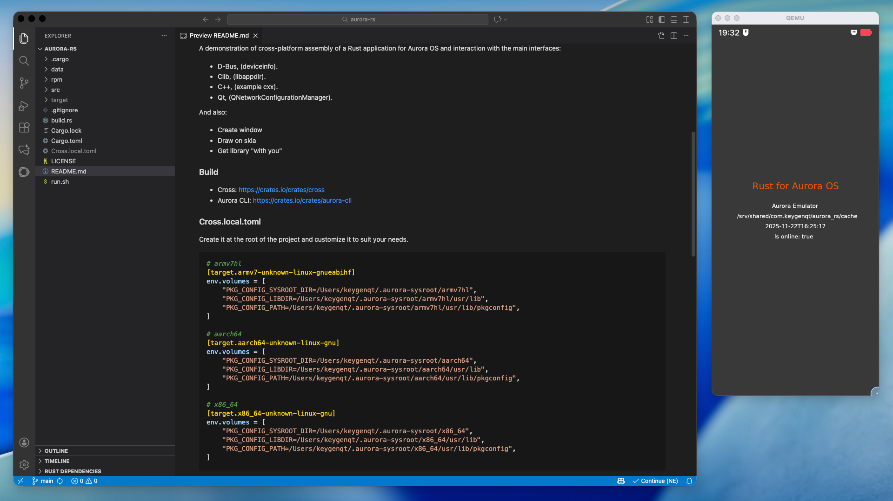

# Rust для ОС Аврора

> 25-11-2025 <span class="github-link">[Материалы к статье :material-git:](https://gitcode.com/keygenqt_vz/aurora-rs)</span>


Привет! Я ведущий инженер-программист, работаю в компании [Открытая мобильная платформа](https://www.omp.ru/) (ОМП), которая занимается разработкой операционной системы Аврора и много чем другим. Недавно я создал проект, в котором продемонстрировал, как можно собрать и запустить приложение Rust на Windows / Linux / macOS для ОС Аврора.

На данный момент, ОС Аврора - это мобильная операционная система. Однако, уже есть прототипы, которые позволяют использовать ОС Аврора, как десктопную или автомобильную операционную систему. ОС Аврора основана на ядре Linux. Предком являлась Sailfish OS, но системы уже давно развиваются отдельно друг от друга. Это в общем, подробнее изучение операционной системы можно начать с https://auroraos.ru.

Официальной поддержки Rust в ОС Аврора нет, в [PSDK](https://developer.auroraos.ru/downloads/p_sdk/5.1.6.110/linux) (набор инструментов для разработки, отладки и тестирования компонентов ОС Аврора, доступный к установке только на Linux) есть устаревшая версия (1.6), которая не подойдет для написания приложений. Я реализовал демонстрационный проект [Rust for Aurora OS](https://gitcode.com/keygenqt_vz/aurora-rs), который показывает как можно получить все необходимое для написания приложения:

- Последнюю версию Rust
- Доступ к основным интерфейсам системы
- Нюансы сборки приложения и пакета RPM
- Кросс-компиляцию на Windows / Linux / macOS

### Создаем проект

Язык Rust можно [установить](https://rust-lang.org/tools/install/) на Windows / Linux / macOS, в комплекте вы получите систему сборки Cargo, с помощью которого можно создать проект:

```shell
cargo new aurora-rs --bin
```

Проект сразу же доступен для сборки, перейдите в созданную директорию `aurora-rs`  и выполните:

```shell
cargo run --
```

Вы должны увидеть текст `Hello, world!`. С этого можно начать.

### Сборка приложения

ОС Аврора поддерживает три архитектуры: `armv7hl`, `aarch64`, `x86_64`. В Rust есть удобная [кросс-компиляция](https://rust-lang.github.io/rustup/cross-compilation.html), но настройка окружения в Windows и macOS для сборки приложения под Linux (он лежит в основе ОС Аврора) -  задача уже непростая. Мы же хотим работать свободно на всех основных ОС: Windows / Linux / macOS. Решить эту задачу поможет проект [Cross](https://github.com/cross-rs/cross) - вам не придется настраивать систему для сборки, достаточно иметь установленный в системе [Docker](https://www.docker.com/).

Но Docker нам понадобится не только для сборки - он также нужен будет для установки [Aurora SDK](https://developer.auroraos.ru/downloads/sdk_bt/5.1.6.110/linux). На данный момент поддержка macOS с процессором Apple silicon (aarch64) есть только в бета-версии Aurora SDK, последняя доступная сейчас 2.5.75, так что мы будем работать с бетой. Возможно на момент чтения 2.5 будет уже стабильной и вам будет проще, сейчас версия дорабатывается и возможны мелкие баги. Но если вы опытный разработчик, проблем возникнуть не должно.

Ставить нужно именно `Build Tools` версию (BT) - это версия со сборкой в контейнере Docker. Но, как я уже говорил, версия Rust там устаревшая и нам не подойдет. Мы будем использовать upstream версию, моя текущая 1.9. Что нам потребуется в докере - это библиотеки для доступа к интерфейсам системы. А там мы имеем набор из различных интерфейсов С/С++/Qt/D-Bus. Позже разберем это, а сейчас сборка.

Установить Cross можно командой:

```shell
cargo install cross --git https://github.com/cross-rs/cross
```

После установки мы можем заменять команды сборки `cargo` на cross - автоматически будет запущен контейнер и пойдет сборка в нем. Например, мы хотим собрать проект под `x86_64`, для этого выполним:

```shell
cross build --target="x86_64-unknown-linux-gnu"
```

После успешной сборки в директории `target/aarch64-unknown-linux-gnu/debug` вы найдете собранное приложение. Но у нас три архитектуры (`armv7hl`, `aarch64`, `x86_64`).  Для архитектур `armv7hl`, `aarch64` необходимо указать `linker`. Сделать это можно в `config.toml`, который находится в директории `.cargo` (если его нет - его нужно создать).

`<project>/.cargo/config.toml`
```toml
# armv7hl
[target.armv7-unknown-linux-gnueabihf]
linker = "arm-linux-gnueabihf-gcc"
rustflags = [
    "-C", "link-arg=-Wl,--as-needed",
]

# aarch64
[target.aarch64-unknown-linux-gnu]
linker = "aarch64-linux-gnu-gcc"
rustflags = [
    "-C", "link-arg=-Wl,--as-needed",
]

# x86_64
[target.x86_64-unknown-linux-gnu]
rustflags = [
    "-C", "link-arg=-Wl,--as-needed",
]
```

Так же здесь мы можем указать общие флаги компиляции через `rustflags`. Флаг `--as-needed` указывает компоновщику включать только те символы (функции, переменные и т.д.) из указанных библиотек, которые действительно используются в программе - нам не нужно лишнее, в ОС Аврора есть грозный валидатор, который не позволит поставить приложение, если там есть не обработанные зависимости.

Еще одна не маловажная особенность - версия `glibc`. В ОС Аврора 5.2 версия glibc 2.38 желательно полное соответствие, но я пошел на компромисс: простота/соответствие. В Ubuntu 24.04 используется версия glibc 2.39. Она максимально близка к ОС Аврора и собранное приложение, которое не использует фичи из 2.39, будет работать на 2.38. Для того, чтобы настроить Cross на использование Ubuntu мы можем указать в `Cargo.toml` настройки для целей сборки:

```toml
# armv7hl
[workspace.metadata.cross.target.armv7-unknown-linux-gnueabihf]
image = "ubuntu:24.04"
pre-build = ["apt-get update && apt-get -y install curl build-essential clang pkg-config g++-arm-linux-gnueabihf"]

# aarch64
[workspace.metadata.cross.target.aarch64-unknown-linux-gnu]
image = "ubuntu:24.04"
pre-build = ["apt-get update && apt-get -y install curl build-essential clang pkg-config g++-aarch64-linux-gnu"]

# x86_64
[workspace.metadata.cross.target.x86_64-unknown-linux-gnu]
image = "ubuntu:24.04"
pre-build = ["apt-get update && apt-get -y install curl build-essential clang pkg-config"]
```

Здесь мы для каждой цели сборки указываем `image` - образ докера, и устанавливаем все необходимое для кросс-компиляции. Теперь, выполнив команду сборки, Cross подтянет нужный нам образ и соберет приложение под нужную нам архитектуру:

```shell
# armv7hl
cross build --target="armv7-unknown-linux-gnueabihf"
# aarch64
cross build --target="aarch64-unknown-linux-gnu"
# x86_64
cross build --target="x86_64-unknown-linux-gnu"
```

### Aurora CLI

Приложение Aurora CLI - моя разработка, инструмент, упрощающий работу с экосистемой ОС Аврора. Он нам понадобится для вывода нашего Rust приложения на новый уровень. Это уже 4я версия Aurora CLI - кроссплатформенная, использующая Аврора SDK (BT) для упрощения процессов. Приложение в разработке, но уже может нам помочь:

- Создаст на хосте директорию с библиотеками, которые нам понадобятся для расширения функционала приложения и доступа к функционалу системы.
- Создаст MOC файлы для классов Qt, которые необходимы для наследования от QObject, что позволит использовать `signal`/`slot` в приложении.
- Соберет RPM пакет, который используется для установки в ОС Аврора, проведет его валидацию и подпишет публичным ключом.

Приложение имеет интерфейс Command Line Interface (CLI) и использует для работы Docker образ, идущий вместе с Аврора SDK (BT). Приложение доступно на [crates.io/aurora-cli](https://crates.io/crates/aurora-cli) и установить его можно на macOS / Linux / Windows командой:

```shell
cargo install aurora-cli
```

### Сборка пакета

Для того, чтобы установить собранное приложение на ОС Аврора необходимо собрать RPM пакет, подписать его, загрузить на эмулятор/устройство, выполнить команду установки, пройти валидатор, отвечающий за безопасность.

Для этого давайте создадим в проекте директорию `rpm` со следующим набором файлов:

```shell
.
├── applications
│   └── com.keygenqt.aurora_rs.desktop
├── bin
│   └── aurora-rs
├── com.keygenqt.aurora_rs.spec
└── icons
    └── hicolor
        ├── 108x108
        │   └── apps
        │       └── com.keygenqt.aurora_rs.png
        ├── 128x128
        │   └── apps
        │       └── com.keygenqt.aurora_rs.png
        ├── 172x172
        │   └── apps
        │       └── com.keygenqt.aurora_rs.png
        └── 86x86
            └── apps
                └── com.keygenqt.aurora_rs.png
```

Структура расположения файлов важна, она используется при сборке пакета. Настройка сборки пакета происходит в `spec` файле, подробную информацию о его настройке можно найти в [документации](https://rpm-software-management.github.io/rpm/manual/spec.html) RPM. Наша настройка будет выглядеть так:

```spec
Name:       com.keygenqt.aurora_rs
Summary:    Rust and interacts with the main interfaces of Aurora OS.
Version:    0.0.1
Release:    1
License:    BSD 3-Clause

%description
%{summary}

%prep
%autosetup

%build

%install
mkdir -p %{buildroot}/%{_bindir}
mkdir -p %{buildroot}/%{_datadir}/icons
mkdir -p %{buildroot}/%{_datadir}/applications
mkdir -p %{buildroot}/%{_datadir}/%{name}/lib
install -m 0755 bin/aurora-rs %{buildroot}/%{_bindir}/%{name}
cp -a icons %{buildroot}/%{_datadir}
cp -a applications %{buildroot}/%{_datadir}

%files
%defattr(-,root,root,-)
%{_bindir}/%{name}
%defattr(644,root,root,-)
%{_datadir}/applications/%{name}.desktop
%{_datadir}/icons/hicolor/*/apps/%{name}.png
```

Файл `desktop` служит для настройки пакета в системе: название приложения, описание, установка прав доступа и другие настройки приложения. Ознакомиться с его настройками можно тут: [Файл .desktop](https://developer.auroraos.ru/doc/software_development/guidelines/rpm_requirements/desktop_requirements).

```desktop
[Desktop Entry]
Type=Application
Name=Aurora Rust
Comment=Rust and interacts with the main interfaces of Aurora OS.
Icon=com.keygenqt.aurora_rs
Exec=/usr/bin/com.keygenqt.aurora_rs
X-Nemo-Application-Type=silica-qt5

[X-Application]
Permissions=
OrganizationName=com.keygenqt
ApplicationName=aurora_rs
```

В директории `bin` находиться 1 файл - наше Rust приложение. Aurora CLI для определения необходимой архитектуры будет его искать именно тут.

В директории `icons` находится набор иконок, который будет собран в пакет и установлен вместе с приложением в систему. Соблюдайте структуру и формат или меняйте настройку `spec` файла под себя.

Получив все необходимое, настроив конфигурацию под себя, если это необходимо, вызываем команду сборки Aurora CLI, указывая директорию с файлами для RPM пакета:

```shell
aurora-cli services --rpmbuild "/path/to/my/rpm"
```

После чего будет выполнен запуск контейнера из образа Build Tools и произведена сборка с подробным выводом.

### Подпись и валидация пакета

Пакет успешно собран. Но не факт что его можно установить на устройство/эмулятор. Он должен проходить валидацию и быть подписан. Aurora CLI поможет выполнить валидацию командой:

```shell
aurora-cli services --validate "/path/to/my/com.keygenqt.aurora_rs.rpm"
```

Команда выдаст подробный отчет и результат. Что важно знать про валидацию - не все зависимости, которые мы указываем, доступны для использования в системе. То есть, если нам нужна, например, библиотека `libfreetype.so` и она даже есть в библиотеках системы, это не значит, что она доступна из приложения, ее нужно взять с собой - что мы дальше и сделаем.

Подпись пакета описана в [документации](https://developer.auroraos.ru/doc/sdk/app_development/packaging/package_signing), нам для проверки работы приложения не нужно заморачиваться - на этот случай есть публичные ключи для тестирования приложений. Aurora CLI подпишет публичным ключом ваш RPM пакет следующей командой:

```shell
aurora-cli services --keysign "/path/to/my/com.keygenqt.aurora_rs.rpm"
```

Если мы прошли валидацию, собрали и подписали пакет - он готов к установке на устройство/эмулятор.

### Установка пакета

Мы установим пакет на эмулятор - он доступен всем после установки Aurora SDK. На Windows / Linux его архитектура `x86_64`, на macOS - `aarch64`, собирайте соотвествующий пакет. Работа с эмулятором в Aurora CLI еще не реализована, но не беда, мы сделаем все через терминал самостоятельно.

Для начала нам нужно загрузить пакет на эмулятор. Доступ к нему можно получить через ключ, лежащий в Aurora SDK по пути `<sdk>/vmshare/ssh/private_keys/sdk`, порт эмулятора `2223`, пользователь `defaultuser`. Загрузить пакет мы можем следующей командой:

```shell
scp -P 2223 -i ~/AuroraOS/vmshare/ssh/private_keys/sdk \
  /path/to/my/com.keygenqt.aurora_rs.rpm \
  defaultuser@localhost:/home/defaultuser/Downloads
```

Перейти по ssh в терминал эмулятора, можно командой:

```shell
ssh -p 2223 -i ~/AuroraOS/vmshare/ssh/private_keys/sdk defaultuser@localhost
```

В директории `/home/defaultuser/Downloads` вы должны найти загруженный пакет готовый к установке. Выполнить установку можно командой:

```shell
gdbus call --system --dest ru.omp.APM --object-path /ru/omp/APM --method ru.omp.APM.Install ~/Downloads/com.keygenqt.aurora_rs.rpm '{}'
```

Если у вас уже стоит этот пакет, его предварительно необходимо удалить:

```shell
gdbus call --system --dest ru.omp.APM --object-path /ru/omp/APM --method ru.omp.APM.Remove com.keygenqt.aurora_rs '{}'
```

Приложение установлено и готово к запуску. Запустить приложение можно через интерфейс системы или через терминал командой:

```shell
runtime-manager-tool Control startDebug com.keygenqt.aurora_rs --output-to-console
```

После запуска приложения в консоле мы должны увидеть наш `Hello, world!` из Rust приложения. Усложним задачу, добавим взаимодействие с системой.

### Интерфейсы

Как нам из приложения получить доступ к функционалу ОС Аврора? Например, мы хотим сохранить данные - как получить путь, необходимый для сохранения кеша? Или мы хотим получить название устройства предоставляемого системой. Возможно, нам нужно получить состояние подключение к сети. Для каждой из этих задач есть свой интерфейс. Получить пути поможет библиотека Си - `appdir`, для получения названия устройства необходимо использовать D-Bus. А состояние сети можно получить через C++/Qt. Отлично, что Rust способен взаимодействовать со всеми этими интерфейсами.

#### D-Bus

D-Bus - это системное IPC (межпроцессное взаимодействие) и высокоуровневый API для операционных систем на базе Unix. Многие задачи можно выполнить через этот интерфейс. Для примера мы воспользуемся [Device Info API](https://developer.auroraos.ru/doc/software_development/reference/device_info) для получения модели устройства. 

Для выполнения запроса потребуется добавление прав на доступ к этой информации. В `desktop` файл приложения добавим `DeviceInfo`:

```desktop
[X-Application]
Permissions=DeviceInfo
```

Подключим крейт [dbus](https://crates.io/crates/dbus) (именно его - он точно будет работать, например [zbus](https://crates.io/crates/zbus) работать отказывается - D-Bus на Aurora OS с небольшими с особенностями):

```toml
[dependencies]
dbus = "0.9.9"
```

Нам остается просто вызвать метод `getDeviceModel`:

```rust
use std::time::Duration;

use dbus::{Error, blocking::Connection};

const DEST: &str = "ru.omp.deviceinfo";
const PATH: &str = "/ru/omp/deviceinfo/Features";
const IFACE: &str = "ru.omp.deviceinfo.Features";

pub fn device_info_get_device_model() -> Option<String> {
    let conn = match Connection::new_system() {
        Ok(conn) => conn,
        Err(_) => return None,
    };
    let proxy = conn.with_proxy(DEST, PATH, Duration::from_millis(5000));
    let result: Result<(String,), Error> = proxy.method_call(IFACE, "getDeviceModel", ());
    if let Ok((result,)) = result {
        Some(result)
    } else {
        None
    }
}
```

Эта функция вернет нам модель девайса в случае успеха.

#### C-lib

Библиотеки Си имеют стабильный Application Binary Interface (ABI) и во многих языках добавлена его поддержка через интерфейс Foreign Function Interface (FFI) - не исключение и Rust. Подключим необходимый крейт [bindgen](https://crates.io/crates/bindgen) для генерации привязок.

```toml
[build-dependencies]
bindgen = "0.72"
```

Воспользуемся [скриптом сборки](https://doc.rust-lang.org/cargo/reference/build-scripts.html) `build.rs`, который необходимо просто добавить в корень проекта. В нем мы можем настроить дополнительные параметры сборки приложения. Нам нужно сгенерировать привязки для доступа к си-библиотеке из Rust. Остался маленький нюанс - где взять эти библиотеки?

Получить библиотеки можно с помощью Aurora CLI. Все библиотеки находятся в образе докера Build Tools, но нам они нужны на хосте. Для этого мы можем выполнить команду для их получения:

```shell
aurora-cli services --sysroot
```

После успешного завершения команды вы найдете в директории `~/.aurora-sysroot` все необходимые библиотеки ОС Аврора для всех архитектур: `armv7hl`, `aarch64`, `x86_64`. Теперь мы можем настроить `build.rs`:

```rust
use std::{env, path::PathBuf};

fn main() {
    let sysroot = PathBuf::from(env::var("PKG_CONFIG_SYSROOT_DIR").unwrap());
    let include = &sysroot.join("usr/include").to_string_lossy().to_string();
    let lib = &sysroot.join("usr/lib").to_string_lossy().to_string();

    // Set rustflags sysroot
    println!("cargo:rustc-link-arg=--sysroot={}", sysroot.to_string_lossy());

    // Set search
    println!("cargo:rustc-link-search={lib}");

    // C appdir
    println!("cargo:rustc-link-lib=appdir");
    bindgen::Builder::default()
        .header(format!("{include}/appdir/appdir.h"))
        .parse_callbacks(Box::new(bindgen::CargoCallbacks::new()))
        .generate()
        .expect("Unable to generate appdir")
        .write_to_file(
            PathBuf::from(env::var("OUT_DIR").unwrap()).join("libappdir.rs")
        )
        .expect("Couldn't write appdir!");
}
```

Переменная окружения  `PKG_CONFIG_SYSROOT_DIR` указывает на директорию `~/.aurora-sysroot` с нужной нам архитектурой. Для всех операционных систем она будет разная, а сборка у нас ведется через Cross, который выполняет сборку в Docker контейнере. Давайте добавим локальную конфигурацию пользователя `Cross.local.toml`, которая будет только его личной - и укажем переменные окружения, одновременно монтируя директории в контейнер. Для моего macOS конфигурация выглядит так:

```toml
# armv7hl
[target.armv7-unknown-linux-gnueabihf]
env.volumes = [
    "PKG_CONFIG_SYSROOT_DIR=/Users/keygenqt/.aurora-sysroot/armv7hl",
    "PKG_CONFIG_LIBDIR=/Users/keygenqt/.aurora-sysroot/armv7hl/usr/lib",
    "PKG_CONFIG_PATH=/Users/keygenqt/.aurora-sysroot/armv7hl/usr/lib/pkgconfig",
]

# aarch64
[target.aarch64-unknown-linux-gnu]
env.volumes = [
    "PKG_CONFIG_SYSROOT_DIR=/Users/keygenqt/.aurora-sysroot/aarch64",
    "PKG_CONFIG_LIBDIR=/Users/keygenqt/.aurora-sysroot/aarch64/usr/lib",
    "PKG_CONFIG_PATH=/Users/keygenqt/.aurora-sysroot/aarch64/usr/lib/pkgconfig",
]

# x86_64
[target.x86_64-unknown-linux-gnu]
env.volumes = [
    "PKG_CONFIG_SYSROOT_DIR=/Users/keygenqt/.aurora-sysroot/x86_64",
    "PKG_CONFIG_LIBDIR=/Users/keygenqt/.aurora-sysroot/x86_64/usr/lib",
    "PKG_CONFIG_PATH=/Users/keygenqt/.aurora-sysroot/x86_64/usr/lib/pkgconfig",
]
```

Применить конфигурацию в команде сборки можно добавив `CROSS_CONFIG` перед командой. Из корня проекта команда будет выглядеть:

```shell
CROSS_CONFIG="Cross.local.toml" cross build --target="x86_64-unknown-linux-gnu"
```

Теперь в контейнер будут монтироваться необходимые директории и устанавливаться переменные окружения. Здесь их три:  `PKG_CONFIG_SYSROOT_DIR`, `PKG_CONFIG_LIBDIR`, `PKG_CONFIG_PATH`. `PKG_CONFIG_SYSROOT_DIR` указывает на глобальный `sysroot` (место, где компилятор должен искать библиотеки), а две другие необходимы для поиска библиотек через `pkg-config` - мы его используем при подключении С++/Qt.

Если вы работаете через [Visual Studio Code](https://code.visualstudio.com/) анализатору rust тоже хотелось бы знать переменную окружения `PKG_CONFIG_SYSROOT_DIR` и другие, ее можно указать в настройках пользователя:

```json
"rust-analyzer.cargo.extraEnv": {
    "PKG_CONFIG_SYSROOT_DIR": "/Users/keygenqt/.aurora-sysroot/aarch64",
    "PKG_CONFIG_LIBDIR": "/Users/keygenqt/.aurora-sysroot/aarch64/usr/lib",
    "PKG_CONFIG_PATH": "/Users/keygenqt/.aurora-sysroot/aarch64/usr/lib/pkgconfig"
},
```

Пути подправьте на свои, это локальные настройки, их совсем чуть-чуть, но они есть, как же без них.

Чтобы добавить в проект привязки, которые генерирует `bindgen`, нужно создать файл со следующим содержимым:

```rust
#![allow(non_upper_case_globals)]
#![allow(non_camel_case_types)]
#![allow(non_snake_case)]
#![allow(dead_code)]
#![allow(unused_imports)]
#![allow(improper_ctypes)]

include!(concat!(env!("OUT_DIR"), "/libappdir.rs"));
```

Этот файл монтируем, как модуль, и все методы из библиотеки становятся нам доступны. Получим директорию кеша приложения:

```rust
use std::ffi::CStr;

use crate::clib::libappdir;

pub fn get_app_cache_location() -> Option<String> {
    let result = unsafe {
        let out = libappdir::appdir_get_path(
            libappdir::PathType_AppCacheLocation
        );
        let str = CStr::from_ptr(out);
        let str = str.to_owned();
        String::from_utf8(str.to_bytes().to_vec())
    };
    match result {
        Ok(app_cache) => Some(app_cache),
        Err(_) => None,
    }
}
```

Эта функция вернет путь к директории приложения, где можно сохранить кеш.

#### С++/Qt

Библиотеки C++ подключить так просто не получится. С++ имеет нестабильный ABI, и FFI под него не делают. Но мы можем воспользоваться отличным крейтом [CXX](https://cxx.rs/), который позволит нам взаимодействовать с C++ из Rust. Так же мы подключим крейт [pkg-config](https://crates.io/crates/pkg-config), который займется поиском всех зависимостей библиотек C++.

```toml
[build-dependencies]
cxx-build = "1.0"
pkg-config = "0.3"
```

Для демонстрации работы подключим библиотеку `Qt5Network` и выполним из нее метод. Так же добавим и наследование класса C++ от QObject - это необходимо для использования системы Qt `signal`/`slot`. Сейчас мы это использовать не будем, но если вам понадобится, вы будете знать как это сделать.

CXX предполагает сделать обертку над кодом С++, то есть нам нужно сделать С++ код, в котором мы уже будем взаимодействовать с библиотеками С++, а он, в свою очередь, будет взаимодействовать с Rust. Давайте сделаем это.

Создадим директорию в проекте: `src/cxx/cpp/qnetwork`. В нее добавим хедер и реализацию:

`cxx_qnetwork.h`
```cpp
#pragma once
#include "rust/cxx.h"
#include <memory>

#include <QNetworkConfigurationManager>

namespace com
{
  namespace keygenqt
  {
    namespace aurora_rs
    {
      class CxxQnetwork : public QObject
      {
        Q_OBJECT

      public:
        CxxQnetwork();
        bool is_online() const;

      private:
        QNetworkConfigurationManager m_manager;
      };

      // Create class
      std::unique_ptr<CxxQnetwork> new_cxx_qnetwork();
    } // namespace aurora_rs
  } // namespace keygenqt
} // namespace com

```

`cxx_qnetwork.cpp`
```cpp
#include "aurora-rs/src/cxx/cpp/qnetwork/cxx_qnetwork.h"
#include "aurora-rs/src/cxx/rust/cxx_qnetwork.rs.h"

namespace com
{
  namespace keygenqt
  {
    namespace aurora_rs
    {
        std::unique_ptr<CxxQnetwork> new_cxx_qnetwork()
        {
            return std::make_unique<CxxQnetwork>();
        }

        CxxQnetwork::CxxQnetwork() {}

        bool CxxQnetwork::is_online() const
        {
            return m_manager.isOnline();
        }
    } // namespace aurora_rs
  } // namespace keygenqt
} // namespace com

#include "cxx_qnetwork.moc"
```

Обратите внимание на строчку внизу файла реализации:

```cpp
#include "cxx_qnetwork.moc"
```

Этого файла у нас нет, но Aurora CLI нам его может создать. Для генерации MOC файлов Qt выполните следующую команду:

```shell
aurora-cli services --moc /path/to/project
```

После успешно выполненной команды у вас в директории рядом с хедером появится файл `cxx_qnetwork.moc`, который необходим для работы Qt.

Подключим CXX к Rust. Для этого создадим директорию в проекте: `src/cxx/rust` и добавим файл `cxx_qnetwork.rs` который будет взаимодействовать с созданным нами классом С++:

```rust
#[cxx::bridge(namespace = "com::keygenqt::aurora_rs")]
mod ffi {
    unsafe extern "C++" {
        include!("aurora-rs/src/cxx/cpp/qnetwork/cxx_qnetwork.h");

        type CxxQnetwork;

        fn new_cxx_qnetwork() -> UniquePtr<CxxQnetwork>;
        fn is_online(&self) -> bool;
    }
}

/// Example execute
pub fn is_online() -> bool {
    ffi::new_cxx_qnetwork().is_online()
}
```

Для работы CXX необходимо добавить `links` в `Cargo.toml`, в моем случае пакет называется `aurora-rs`:

```toml
[package]
links = "aurora-rs"
```

Осталось подключить библиотеки Qt, и после сборки функция `is_online` должна указать на подключение к сети. Но для ее работы необходимо добавить права доступа в `desktop` файл `Internet`:

```desktop
[X-Application]
Permissions=DeviceInfo;Internet
```

Подключение С++ библиотек и генерация привязок C++ может выглядеть следующим образом:

```rust
if cfg!(target_os = "linux") {
    let cpp_libs = vec!["Qt5Core", "Qt5Network"];
    let includes: Vec<Vec<PathBuf>> = cpp_libs
        .iter()
        .map(|lib| pkg_config::probe_library(lib).unwrap().include_paths)
        .collect();
    for bridge_name in ["format", "qnetwork"] {
        cxx_build::bridge(format!("src/cxx/rust/cxx_{bridge_name}.rs"))
            .includes(includes.iter().flatten())
            .std("c++17")
            .file(format!("src/cxx/cpp/{bridge_name}/cxx_{bridge_name}.cpp"))
            .compile(bridge_name);
        println!("cargo:rerun-if-changed=src/cxx/cpp/{bridge_name}/cxx_{bridge_name}.h");
        println!("cargo:rerun-if-changed=src/cxx/cpp/{bridge_name}/cxx_{bridge_name}.cpp");
        println!("cargo:rerun-if-changed=src/cxx/rust/cxx_{bridge_name}.rs");
    }
    for lib in cpp_libs {
        println!("cargo:rustc-link-lib={lib}");
    }
}
```

Что здесь стоит отметить:

- Помимо самого `Qt5Network` необходимо подключить и `Qt5Core`.
- Генерация доступна только для Linux - но работе на других ОС это не мешает, для них ее можно просто отключить.
- Библиотеки нужно привязать к приложению после выполнения генерации, иначе вы может столкнуться с проблемой `undefined reference`.

Мы готовы к сборке и выполнению метода `is_online`.

### GUI

Приложение уже умеет работать с D-Bus, C-lib, C++/Qt, но как нам вывести эту информацию на экран? Для этого мы воспользуемся доработанной под ОС Аврора крейтом [winit](https://github.com/lmaxyz/winit) и нарисуем на [skia-safe](https://crates.io/crates/skia-safe) первый кадр. Подключить все необходимое для этого можно так:

```toml
[dependencies]
winit = { git = "https://github.com/lmaxyz/winit", branch = "aurora" }
skia-safe = "0.90.0"
softbuffer = "0.4.6"
image = "0.25.6"
```

Не буду приводить весь код, с ним можно ознакомиться в [репозитории](https://gitcode.com/keygenqt_vz/aurora-rs) проекта. Главное окно создается в методе `show`, здесь же мы его инициализируем и подписываемся на события. При получении события `WindowEvent::RedrawRequested` мы получаем буфер поверхности, на skia рисуем контент, который конвертируется в изображение и рисуем его:

```rust
use image::GenericImageView;
use softbuffer::Context;
use softbuffer::Surface;
use std::num::NonZeroU32;
use winit::event::WindowEvent;
use winit::event::Event;
use winit::event_loop::{ControlFlow, EventLoop};

use crate::AppInfo;
use crate::window::app_skia;

#[path = "application.rs"]
mod application;

pub fn show(app_info: AppInfo, event_loop: EventLoop<()>) {
    let app = application::WinitAppBuilder::with_init(
        move |elwt| {
            let app_info = app_info.clone();
            let window = application::make_window(&app_info, elwt, |w| w);
            let context = Context::new(window.clone()).unwrap();
            (app_info, window, context)
        },
        |_elwt, (_, window, context)| Surface::new(context, window.clone()).unwrap(),
    )
    .with_event_handler(|(app_info, window, _context), surface, event, elwt| {
        elwt.set_control_flow(ControlFlow::Wait);
        match event {
            Event::WindowEvent {
                window_id,
                event: WindowEvent::RedrawRequested,
            } if window_id == window.id() => {
                let Some(surface) = surface else {
                    eprintln!("RedrawRequested fired before Resumed or after Suspended");
                    return;
                };
                let size = window.inner_size();
                if let (Some(width), Some(height)) =
                    (NonZeroU32::new(size.width), NonZeroU32::new(size.height))
                {
                    surface
                        .resize(width, height)
                        .expect("Failed to resize surface");
                    // Get image from skia draw
                    let image = app_skia::main::draw(
                        app_info,
                        u32::from(width) as i32,
                        u32::from(height) as i32
                    ).expect("Failed to draw image");
                    // Update buffer
                    let mut buffer = surface.buffer_mut().unwrap();
                    let width = image.width() as usize;
                    for (x, y, pixel) in image.pixels() {
                        let red = pixel.0[0] as u32;
                        let green = pixel.0[1] as u32;
                        let blue = pixel.0[2] as u32;
                        let color = blue | (green << 8) | (red << 16);
                        buffer[y as usize * width + x as usize] = color;
                    }
                    // Redraw surface
                    buffer.present().unwrap();
                }
            }
            _ => {}
        }
    });
    application::run(event_loop, app);
}

```

Приложение демонстрационное и чтобы не перегружать его изображение рисуется один раз. Поэтому нам подойдет такой простой способ получения из skia `image_snapshot` и отрисовка его в буфере всего один раз. Рисование на skia - занимательная задача, это достаточно низкоуровневая библиотека:

```rust
use image::DynamicImage;

use skia_safe::{Color, EncodedImageFormat, Font, FontMgr, FontStyle, Paint, TextBlob};

use crate::AppInfo;

pub fn draw(
    app_info: &AppInfo,
    width: i32,
    height: i32,
) -> Result<DynamicImage, Box<dyn std::error::Error>> {
    // Create surface
    let mut surface = skia_safe::surfaces::raster_n32_premul((width, height)).unwrap();
    let canvas = surface.canvas();

    // Get font
    let typeface = FontMgr::new()
        .legacy_make_typeface(None, FontStyle::default())
        .unwrap();

    // Get paint
    let paint = &mut Paint::default();

    // Set background color
    canvas.clear(Color::from_rgb(50, 50, 50));

    let shift = 90;

    // Title
    paint.set_color(Color::from_rgb(246, 87, 0));
    let font_size = 40.0;
    let text = &app_info.title;
    let x = width / 2 - (text.len() as i32 * font_size as i32 / 4);
    let y = (height / 2) - shift;
    let font = Font::from_typeface(&typeface, font_size);
    let blob = TextBlob::from_str(text, &font).unwrap();
    let _ = canvas.draw_text_blob(&blob, (x - 5, y), paint);

    // D-Bus
    paint.set_color(Color::WHITE);
    let font_size = 24.0;
    let text = &app_info.model;
    let x = width / 2 - (text.len() as i32 * font_size as i32 / 4);
    let y = (height / 2 + 40 + 40) - shift;
    let font = Font::from_typeface(&typeface, font_size);
    let blob = TextBlob::from_str(text, &font).unwrap();
    let _ = canvas.draw_text_blob(&blob, (x - 10, y), paint);

    // C lib
    paint.set_color(Color::WHITE);
    let font_size = 24.0;
    let text = &app_info.location;
    let x = width / 2 - (text.len() as i32 * font_size as i32 / 4);
    let y = (height / 2 + (40 + 40) + 24 + 20) - shift;
    let font = Font::from_typeface(&typeface, font_size);
    let blob = TextBlob::from_str(text, &font).unwrap();
    let _ = canvas.draw_text_blob(&blob, (x - 10, y), paint);

    // C++ clear
    paint.set_color(Color::WHITE);
    let font_size = 24.0;
    let text = &app_info.format;
    let x = width / 2 - (text.len() as i32 * font_size as i32 / 4);
    let y = (height / 2 + (40 + 40) + (24 + 20) + 24 + 20) - shift;
    let font = Font::from_typeface(&typeface, font_size);
    let blob = TextBlob::from_str(text, &font).unwrap();
    let _ = canvas.draw_text_blob(&blob, (x - 15, y), paint);

    // C++ Qt
    paint.set_color(Color::WHITE);
    let font_size = 24.0;
    let text = &format!("Is online: {}", app_info.is_online);
    let x = width / 2 - (text.len() as i32 * font_size as i32 / 4);
    let y = (height / 2 + (40 + 40) + (24 + 20) + (24 + 20) + 24 + 20) - shift;
    let font = Font::from_typeface(&typeface, font_size);
    let blob = TextBlob::from_str(text, &font).unwrap();
    let _ = canvas.draw_text_blob(&blob, (x, y), paint);

    // Get image
    let image = surface.image_snapshot();
    let mut context = surface.direct_context();
    let binding = image
        .encode(context.as_mut(), EncodedImageFormat::PNG, None)
        .expect("Fail get image");
    Ok(image::load_from_memory(binding.as_bytes())?)
}
```

 > В статье я не описывал создание чистого С++, без зависимостей - `format`, мы рассмотрели сразу сложный пример с использованием зависимости Qt.

Теперь мы можем объединить все приложение для вывода данных, полученных нами из ОС Аврора. Добавим в `main.rs` следующий код:

```rust
use winit::event_loop::EventLoop;

mod clib;
mod cxx;
mod dbus;
mod window;

#[derive(Clone, Debug)]
pub struct AppInfo {
    title: String,
    model: String,
    location: String,
    format: String,
    is_online: bool,
}

impl AppInfo {
    fn new() -> Self {
        AppInfo {
            title: "Rust for Aurora OS".to_string(),
            model: dbus::dbus_deviceinfo::device_info_get_device_model().unwrap(),
            location: clib::c_appdir::get_app_cache_location().unwrap(),
            format: cxx::rust::cxx_format::time("yyyy-mm-ddThh:mm:ssZ"),
            is_online: cxx::rust::cxx_qnetwork::is_online(),
        }
    }
}

fn main() {
    // Run window
    window::app_winit::main::show(AppInfo::new(), EventLoop::new().unwrap());
}
```

Приложение готово, но это еще не конец. Есть один важный нюанс - валидатор нас не пропустит: Skia использует библиотеку `freetype`, которая запрещена, она не доступна в системе из приложения. Ее нужно взять с собой. Она есть в созданном Aurora CLI `~/.aurora-sysroot`, собирать самостоятельно ее не придется. Первым делом помещаем зависимость в директорию `rpm`:

```shell
.
├── RPMS
│   └── aarch64
│       ├── com.keygenqt.aurora_rs-0.0.1-1.aarch64.rpm
│       ├── com.keygenqt.aurora_rs-debuginfo-0.0.1-1.aarch64.rpm
│       └── com.keygenqt.aurora_rs-debugsource-0.0.1-1.aarch64.rpm
├── applications
│   └── com.keygenqt.aurora_rs.desktop
├── bin
│   └── aurora-rs
├── com.keygenqt.aurora_rs.spec
├── icons
│   └── hicolor
│       ├── 108x108
│       │   └── apps
│       │       └── com.keygenqt.aurora_rs.png
│       ├── 128x128
│       │   └── apps
│       │       └── com.keygenqt.aurora_rs.png
│       ├── 172x172
│       │   └── apps
│       │       └── com.keygenqt.aurora_rs.png
│       └── 86x86
│           └── apps
│               └── com.keygenqt.aurora_rs.png
└── libs
    ├── aarch64
    │   └── libfreetype.so.6
    ├── armv7hl
    │   └── libfreetype.so.6
    └── x86_64
        └── libfreetype.so.6
```

Для того, чтобы сказать валидатору, что библиотека у нас с собой, добавим в начало `spec` файла пару строк:

```spec
%global __provides_exclude_from ^%{_datadir}/%{name}/lib/.*$
%global __requires_exclude ^lib(freetype)\\.so.*$
```

И возьмем ее с собой в rpm пакет, подправив `%install` и `%files`:

```spec
%install
mkdir -p %{buildroot}/%{_bindir}
mkdir -p %{buildroot}/%{_datadir}/icons
mkdir -p %{buildroot}/%{_datadir}/applications
mkdir -p %{buildroot}/%{_datadir}/%{name}/lib
install -m 0755 bin/aurora-rs %{buildroot}/%{_bindir}/%{name}
install -m 644 libs/%{_target_cpu}/*so* %{buildroot}/%{_datadir}/%{name}/lib
cp -a icons %{buildroot}/%{_datadir}
cp -a applications %{buildroot}/%{_datadir}

%files
%defattr(-,root,root,-)
%{_bindir}/%{name}
%defattr(644,root,root,-)
%{_datadir}/%{name}/lib/*so*
%{_datadir}/applications/%{name}.desktop
%{_datadir}/icons/hicolor/*/apps/%{name}.png
```

При сборке библиотека будет добавляться в наш rpm пакет с нужной архитектурой. Но и на этом еще не конец. Валидатор будет нервничать когда не найдет `RPATH`, при сборке Rust добавляет `RUNPATH` и нам нужно добавить строчку в `build.rs`, указав именно `RPATH`:

```rust
println!("cargo:rustc-link-arg=-Wl,--disable-new-dtags,-rpath=/usr/share/com.keygenqt.aurora_rs/lib");
```

Теперь мы закончили, можно собрать проект и получить следующий результат:



Все описанное доступно для самостоятельного изучения в проекте [Rust for Aurora OS](https://gitcode.com/keygenqt_vz/aurora-rs).