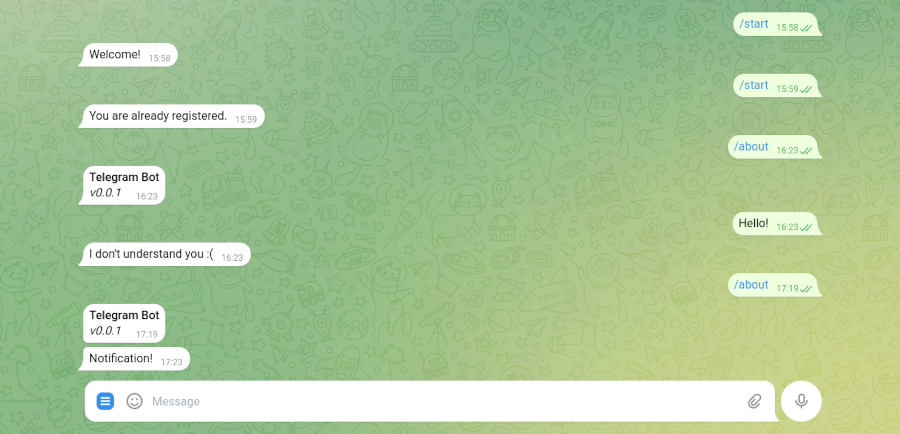

# Telegram Bot. Простой, для сложных задач.

> 09-01-2025 <span class="github-link">[Материалы к статье :material-github:](https://github.com/keygenqt/publications/tree/main/materials/ktor-bot-sample)</span>

В этой статье я расскажу, как создать Telegram бота. Научим его отвечать на вопросы, использовать меню и осуществлять рассылку уведомлений пользователям. Выберем инструменты для реализации. Познакомимся с некоторыми хитростями и советами при реализации, которые я нашел для себя при написании [Aurora Bot](https://aurora-cos.keygenqt.com/aurora-bot/). А сервер Ktor и база данных Postgres поможет нам организовать такую рассылку. Сделаем задел на создание в будущем Mini-App и на общее развитие бота.

### Что такое бот

Вы переписывались в Telegram с кем-нибудь? Ну вот базовый бот это тоже самое - личка, в которой бот может реагировать на ваши запросы. Зашли в бота, ткнули `/start` и вы можете общаться с ботами, которые могут быть очень различными по функционалу. Когда вы подписываетесь на бота, он может получить ограниченные данные о вас через API Telegram и может обращаться к вам самостоятельно.

Для общения с Telegram API используются библиотеки, удобные для языка, который вы выбрали для написания серверной части бота - она и будет отвечать на сообщения, присланные пользователем бота, и реагировать на различные события, такие как вызовы меню, переходы по диплинке, работа с Mini-App. 

Бот - это участник Telegram сообщества: он может быть администратором канала, может общаться с пользователями и т.д. - но всему этому его нужно учить. Все обращения на сервер происходят в текстовом формате, что ответить на них решать вам.

На сервер приходят события из API, вы на них реагируете, но бот не всегда ждет событий от пользователя - он также может быть инициатором их. Например, вы хотите уведомить пользователя о каком-либо событии. Если он подписан на бота, это можно сделать, в противном случае - нет. Для этого вам придется записать данные пользователя, чтобы к нему обратиться.

Резюмирую что такое бот - это просто интерфейс вашего сервера, который работает через Telegram API и доступен всем пользователям Telegram без дополнительной регистрации. Интерфейс, который позволяет автоматизировать многие процессы на ваших Telegram каналах и вообще работу с Telegram.

### Выбор инструментов

Бот работает через Telegram API. Вы можете использовать для подобной задачи то, что вам по душе. Мне, например, по душе язык Kotlin, и все что остается мне - подумать: использовать API напрямую или найти библиотеку, которая упростит мне жизнь. И такая библиотека есть для Java - [telegrambots](https://github.com/rubenlagus/TelegramBots). Нам вполне подойдет.

Kotlin можно использовать с популярнейшем фреймворком [Spring](https://spring.io/), но... когда я пробовал его использовать с Kotlin, были не очевидные проблемы, на решение которых приходилось тратить время. Меня вполне устраивает [Ktor](https://ktor.io/), который был рожден для работы с Kotlin. Поднимать сервер для работы с ботом совсем не обязательно, но есть задачи, для которых он необходим: работа с Mini-App, выполнение отложенных задач и многое другое.

Нам нужно помнить пользователей, если хотим обращаться к ним, управлять состоянием каналов пользователей, повышать релевантность ответов. Для таких задачи нам необходима база данных. Нам отлично подойдет база данных Postgres. В Ktor поддержка этой базы данных есть из коробки.

Еще момент, который стоит учесть - у сервера бота должна быть командная строка (Command-line interface - CLI). С помощью CLI можно будет автоматизировать через планировщик задач (например Cron) необходимый функционал на сервере. Для примера это могут быть синхронизация данных, очистка базы данных от устаревших токенов, рассылка уведомлений. Для организации CLI отлично подойдет [picocli](https://picocli.info/).

Итого мой выбор инструментов такой:
- Язык - Kotlin
- Server - Ktor
- База данных - Postgres
- CLI - Picocli
### Пишем бота

**Шаблон**

Начнем с создания шаблона проекта. Базой для проекта будет являться сервер Ktor. Создать проект Ktor можно на сайте Ktor в разделе [Create](https://start.ktor.io/settings). По умолчанию подключены базовые библиотеки для сервера, мы еще подключим несколько библиотек сразу:
- Exposed - это облегченная библиотека SQL на основе драйвера JDBC для языка Kotlin.
- Postgres - мощная система управления реляционными базами данных (СУБД) с открытым исходным кодом.


Скачиваем получившийся архив, распаковываем и открываем его в `IntelliJ IDEA Community Edition`.

> JetBrains спрятали Community Edition, фиг найдешь. Для установки этой IDE я использую, обычно, [JetBrains Toolbox App](https://www.jetbrains.com/toolbox-app/).

**Postgres**

На следующем этапе подключим базу данных и запустим сервер. Поставить Postgres можно командой (если вы на Ubuntu, для других дистрибьюторов и ОС команду лучше загуглить): 

```shell
sudo apt install postgresql
```

Клиент можно взять, например, [DBeaver](https://dbeaver.io/download/) - он универсальный. С помощью DBeaver можно посмотреть что происходит в базе, подправить, при необходимости, данные в базе. Для подключения необходимо установить пароль на пользователя по умолчанию `postgres`. Для этого выполните:

```shell
sudo systemctl start postgresql.service
sudo -i -u postgres
psql
\password
```

После установки пароля можно подключиться к базе. В DBeaver выберите базу данных Postgres, подправьте пароль и проверьте подключение. После успешного соединения вы должны увидеть следующую картину:


Настроив базу данных, перейдем к серверу. Первым делом нам нужно добавить миграции. Миграции необходимы для модификации структуры базы данных. Они позволяют сохранять структуру базы в коде проекта. Я для этого использую библиотеку [Flyway](https://github.com/flyway/flyway): подключим ее в `libs.versions.toml` и укажем подключение в `build.gradle.kts`.

`libs.versions.toml`
```toml
[versions]  
flyway-version = "11.1.0"  
  
[libraries]  
flyway-core = { module = "org.flywaydb:flyway-core", version.ref = "flyway-version" }  
flyway-database-postgresql = { module = "org.flywaydb:flyway-database-postgresql", version.ref = "flyway-version" }
```

`build.gradle.kts`
```kotlin
dependencies {   
    implementation(libs.flyway.core)  
    implementation(libs.flyway.database.postgresql) 
}
```

Для отправки сообщения пользователю необходимо указать его Telegram ID. Если пользователь к нам обращается, а мы отвечаем - ID нам известен, но для фичи нотификации при регистрации нужно зафиксировать. Telegram API отдает больше информации о пользователе, но для демонстрации нам хватит имени пользователя и его ID. По умолчанию Ktor/Create должен был создать класс `ExposedUser`. Подправим код файла `UsersSchema.kt`, предлагаемый шаблоном Ktor.  Но сначала добавим еще одну библиотеку Exposed, облегчающую работу с базой данных `exposed-dao`. 

`libs.versions.toml`
```toml
[libraries]
exposed-dao = { module = "org.jetbrains.exposed:exposed-dao", version.ref = "exposed-version" }
```

`build.gradle.kts`
```kotlin
implementation(libs.exposed.dao)
```

В результате правок `ExposedUser` получился такой вариант пользователя, который мы добавим в миграции и будем использовать для записи Telegram-ID пользователя:

`UsersSchema.kt`
```kotlin
// Table
object Users : IntIdTable() {
    val idTg = long("idTg").uniqueIndex()
    val name = varchar("name", length = 255)
}

// Entity
class UserEntity(id: EntityID<Int>) : IntEntity(id) {
    companion object : IntEntityClass<UserEntity>(Users)

    var idTg by Users.idTg
    var name by Users.name
}

// Service entity user table
class UserService(private val database: Database) {
    suspend fun getAll() = transaction {
        UserEntity.all().toList()
    }

    suspend fun isHash(idTg: Long) = transaction {
        UserEntity.find { (Users.idTg eq idTg) }.count() != 0L
    }

    suspend fun insert(idTg: Long, name: String) = transaction {
        UserEntity.new {
            this.idTg = idTg
            this.name = name
        }
    }

    private suspend fun <T> transaction(block: suspend () -> T): T {
        return newSuspendedTransaction(
            context = Dispatchers.IO,
            db = database
        ) { block() }
    }
}
```

Все библиотеки подключены, Exposed готов, подготовим миграции. Для этого мы просто создаем раздел `migration`и добавляем Kotlin класс, наследуясь от `BaseJavaMigration`:

```kotlin
class V0001__Create_Users : BaseJavaMigration() {  
    override fun migrate(context: Context?) {  
        transaction {  
            SchemaUtils.create(Users)  
        }  
    }  
}
```

> Обратите внимание на названия, по нему библиотека определяет что уже попало в базу, а что еще предстоит добавить. Детали в [документации](https://documentation.red-gate.com/fd/redgate-flyway-documentation-138346877.html) Flyway.


И последнее, что необходимо сделать - подключить Ktor сервер к базе данных. В проекте Ktor точка входа - `Application.module()`, здесь можно найти все подключения и стартовые настройки. Перейдем в метод `configureDatabases` и настроим его под себя:

`Databases.kt`
```kotlin
fun Application.configureDatabases() {  
    // Get data from config  
    val url = environment.config.property("postgres.url").getString()  
    val user = environment.config.property("postgres.user").getString()  
    val password = environment.config.property("postgres.password").getString()  
    // Connect to db with migrations  
    val database = Database.connectWithFlyway(  
        url = url,  
        user = user,  
        password = password,  
        migration = "com/example/migration"  
    ) ?: throw RuntimeException("Error connect to DB!")  
    // Init service user  
    val userService = UserService(database)  
}  
  
private fun Database.Companion.connectWithFlyway(  
    url: String,  
    user: String,  
    password: String,  
    migration: String  
): Database? {  
    return try {  
        val database = connect(  
            url = url,  
            user = user,  
            password = password,  
        )  
        val flyway = Flyway.configure()  
            .locations(migration)  
            .dataSource(url, user, password)  
            .load()  
        flyway.info()  
        flyway.migrate()  
        database  
    } catch (e: Exception) {  
        null  
    }  
}
```

Доступ к базе данных не должен находиться в коде проекта, для этого есть конфигурационный файл - `application.yaml`, и получить данные из него можно, как показано выше. Конфигурационный файл не хранится в репозитории проекта, а доступен только на локальной машине. Обычно добавляют демо-файл, назвать его можно, например, `_application.yaml`, для упрощения поднятия сервера. Сейчас он выглядит так, доступы были обновлены для подключения к Postgres:

`application.yaml`
```yaml
ktor:  
  development: true  
  application:  
    modules:  
      - com.example.ApplicationKt.module  
  deployment:  
    port: 8080  
postgres:  
  url: "jdbc:postgresql://localhost:5432/postgres"  
  user: postgres  
  password: 12345678
```

Все настроено для запуска сервера, теперь можно найти в IDE функцию `main` и нажать зеленую стрелочку или выполнить в терминале команду `./gradlew runFatJar`. После запуска в логах консоли, вы обнаружите ссылку на запущенный сервер, а в DBeaver можно будет найти таблицу users:


Для доступа к `UserService` удобно использовать DI. Для сервера я обычно использую [Koin](https://insert-koin.io/). Давайте подключим его и добавим `UserService` для получения сервиса при запросе к API, который мы добавим для рассылки.

`libs.versions.toml`
```toml
[versions]  
koin-version = "4.0.1"
  
[libraries]  
koin-core = { module = "io.insert-koin:koin-core", version.ref = "koin-version" }
```

`build.gradle.kts`
```kotlin
dependencies {   
    implementation(libs.koin.core)
}
```

Теперь можно добавить сервис `UserService` в DI:

`Databases.kt`
```kotlin
import org.koin.core.context.GlobalContext.loadKoinModules  
import org.koin.dsl.module as moduleKoin

fun Application.configureDatabases() {
	//...
	// Add services DB to DI  
	loadKoinModules(moduleKoin {  
	    single { UserService(database) }  
	})
}
```

А в файле `Application.kt` инициализируем Koin.

> Разделение инициализации Koin будет удобно при расширении функционала CLI в дальнейшем, сейчас я просто показал, как это можно будет сделать на будущее.

`Application.kt`
```kotlin
fun Application.module() {  
    val isDevelopment = environment.config.property("ktor.development")  
        .getString().toBoolean()  
    startKoin {  
        printLogger(if (isDevelopment) Level.DEBUG else Level.NONE)  
    }  
    //... 
}
```

Подключив DI, мы можем получать экземпляр сервиса таким образом:

```kotlin
val userService: UserService by inject(UserService::class.java)
```

**Ktor API**

Давайте добавим первый метод API, после вызова которого будет происходить получение всех пользователей, зарегистрировавшихся в Telegram боте, и вывод их ID в лог. В дальнейшем мы к нему подключим рассылку сообщений. Для этого у нас уже есть в проекте метод `configureRouting`. 

Но не забудем и про главную страницу API, я всегда добавляю красивую страничку, объясняющую пользователям куда они попали. Ktor умеет выводить HTML, но для этого нужно добавить библиотеку `html-builder` и библиотеку `kotlinx.html`, позволяющие формировать HTML в удобном для Kotlin формате - DSL:

`libs.versions.toml`
```toml
[versions]  
kotlinx-html-version = "0.11.0"

[libraries]
kotlinx-html = { module = "org.jetbrains.kotlinx:kotlinx-html", version.ref = "kotlinx-html-version" }
ktor-server-html-builder = { module = "io.ktor:ktor-server-html-builder", version.ref = "koin-version" }
```

`build.gradle.kts`
```kotlin
dependencies {   
    implementation(libs.kotlinx.html)
    implementation(libs.ktor.server.html.builder)
}
```

Я рекомендую начинать методы API с префикса `/api` - это позволяет легко проксировать API на web-сайты, а так же оставить рут для сайта. Страница роутинга принимает следующий вид:

```kotlin
fun Application.configureRouting() {  
    routing {  
        main()  
        route("/api") {  
            notification()  
        }  
    }
}  
  
private fun Route.main() {
    get("/") {
        call.respondHtml {
            style = "width: 100%; height: 100%; background: black;"
            body {
                style = "width: 100%; height: 100%; margin: 0;"
                table {
                    style = "width: 100%; height: 100%;"
                    tr {
                        td {
                            h1 {
                                style = "color: white; text-align: center;"
                                +"REST API for Telegram Bot!"
                            }
                        }
                    }
                }
            }
        }
    }
}
  
private fun Route.notification() {  
    get("/notification") {  
        // service  
        val userService: UserService by inject(UserService::class.java)  
        // act  
        runBlocking {  
            userService.getAll().forEach {  
                println(it.idTg)  
            }  
        }        
        // response  
        call.response.status(  
            HttpStatusCode(  
                HttpStatusCode.OK.value,  
                "Notification completed successfully!"  
            )  
        )  
    }  
}
```

Запустив сервер после изменений на главной странице [http://0.0.0.0:8080/](http://0.0.0.0:8080/), вы найдете страницу в формате HTML. Это не самая красивая страница, но есть с чего начать:


А по ссылке [http://0.0.0.0:8080/api/notification](http://0.0.0.0:8080/api/notification) мы можем выполнить получение списка пользователей и их ID Telegram. У нас их пока нет. Чтобы пользователи попадали в наш список, они должны в боте выполнить команду `/start` - это всегда первая команда на вход в бота.

### Регистрация бота

Теперь мы можем подключить бота. У нас есть где регистрировать пользователей: мы имеем конфигурационный файл, где можно сохранить секьюрные данные токен бота. Давайте его зарегистрируем. Для этого перейдем в бота Telegram - [@BotFather](https://t.me/BotFather). Я бы советовал регистрировать сразу два - один публичный доступный всем, второй для тестирования и доступа бета пользователей.

> Важный нюанс, который стоит знать - сервер с ботом может быть запущен только 1 раз. То есть, если вы из CLI захотите сделать рассылку с запущенным ботом, вы этого сделать не сможете - экземпляр бота уже работает, и тут нам очень пригодится сервер Ktor. Через него мы сможем обратиться к уже запущенному боту через API.

Запускаем процесс создания нового бота `/newbot`:


Бот будет доступен по ссылке [https://t.me/demo_telegram_my_bot](https://t.me/demo_telegram_my_bot), в моем случае.


Через @BotFather мы можем настроить меню бота - кнопка в интерфейсе бота с командами. Команда в боте не сильно отличается от простого сообщения - это просто текст, приходящий в методе событий. На сервере программист решит, как реагировать на эту команду, также, как и все другие сообщения, обращенные к боту. Давайте добавим команду `/about` для вывода информации о нашем боте. Для этого выполним команду @BotFather `/mybots`:


Теперь у нас есть токен бота, по которому можно подключиться к Telegram API. Добавим токен в конфигурационный файл и библиотеку в проект:

`application.yaml`
```yaml
telegram:  
  token: "9082348972:SDFwewe234dsfDsdf5dff6345fdgFdfddsS"
```

`libs.versions.toml`
```toml
[versions]  
telegrambots-version = "6.9.7.1"

[libraries]
telegrambots = { module = "org.telegram:telegrambots", version.ref = "telegrambots-version" }
```

`build.gradle.kts`
```kotlin
dependencies {   
    implementation(libs.telegrambots)
}
```

Инициализируем бота в проекте. Создадим класс и наследуем его от `TelegramLongPollingBot`:

`AppBot.kt`
```kotlin
class AppBot(token: String) : TelegramLongPollingBot(token) {  
    override fun getBotUsername(): String {  
        return "Telegram Bot"  
    }  
  
    override fun onUpdateReceived(update: Update) {  
        // All bot messages will be sent here.  
    }
    
	fun sendMessage(idTg: Long, text: String) {
        execute(
            SendMessage.builder()
                .chatId(idTg.toString())
                .parseMode("html")
                .text(text)
                .build()
        )
    }
}
```

`Application.kt`
```kotlin
fun Application.module() {
    // get from config params
    val isDevelopment = environment.config.property("ktor.development")
        .getString().toBoolean()
    val botToken = environment.config.property("telegram.token")
        .getString()
    // Init Telegram Bot
    val bot = AppBot(botToken).apply {
        TelegramBotsApi(DefaultBotSession::class.java).registerBot(this)
    }
    // Start Koin
    startKoin {
        printLogger(if (isDevelopment) Level.DEBUG else Level.NONE)
		modules(module {  
		    single { bot }  
		})
    }
    // Init DB
    configureDatabases()
    // Init Routing
    configureRouting()
}
```

Бота помещаем в Koin - нам же нужно делать рассылку при запросе в API `notification`. Обновим метод API `notification`:

`Routing.kt`
```kotlin
private fun Route.notification() {
    get("/notification") {
        // service
        val userService: UserService by inject(UserService::class.java)
        val appBot: AppBot by inject(AppBot::class.java)
        // act
        runBlocking {
            userService.getAll().forEach {
                try {
                    appBot.sendMessage(it.idTg, "Notification!")
                } catch (ex: Exception) {
                    println("Failed to send message to this user: ${it.idTg}")
                }
            }
        }
        // response
        call.response.status(
            HttpStatusCode(
                HttpStatusCode.OK.value,
                "Notification completed successfully!"
            )
        )
    }
}
```

В этом методе происходит:

1. Получение пользователей из базы данных.
2. Отсылка сообщения пользователю в чат уведомления.
3. Обработка ошибки - пользователь может выйти из бота.
4. При успешном выполнении метода статус 200.

Осталось добавить запись пользователя при первом сообщении `/start` и поприветствовать его:

`AppBot.kt`
```kotlin
//...
override fun onUpdateReceived(update: Update) {  
    // Get data  
    val message = update.message.text  
    val user = update.message.from  
    // Start message  
    if (message == "/start") {  
        runBlocking {  
            if (userService.isHash(user.id)) {  
                sendMessage(user.id, "You are already registered.")  
            } else {  
                userService.insert(  
                    idTg = update.message.from.id,  
                    name = update.message.from.firstName,  
                )  
                sendMessage(user.id, "Welcome!")  
            }  
        }  
    }  
}
//...
```

После перезапуска сервера, можно пройти регистрацию, выполнив команду `/start`.

> В бета-боте можно использовать Telegram ID для ограничения к нему доступа пользователей.


В Telegram есть два возможных варианта форматов сообщения - `html` и `markdown`. Детально с ними можно ознакомиться на странице документации Telegram - [Formatting options](https://core.telegram.org/bots/api#formatting-options). Я рекомендую использовать HTML - если внести небольшую ошибку в сообщение, оно просто не отправится. Допустить ошибку в markdown намного проще, чем в HTML. Давайте еще добавим реакцию на пункт меню `/about` и обработку незнакомых команд и запросов.

`AppBot.kt`
```kotlin
//...
override fun onUpdateReceived(update: Update) {  
    // Get data  
    val message = update.message.text  
    val user = update.message.from  
    // Start message  
    if (message == "/start") {  
        runBlocking {  
            if (userService.isHash(user.id)) {  
                sendMessage(user.id, "You are already registered.")  
            } else {  
                userService.insert(  
                    idTg = update.message.from.id,  
                    name = update.message.from.firstName,  
                )  
                sendMessage(user.id, "Welcome!")  
            }  
        }  
        return  
    }  
    if (message == "/about") {  
        sendMessage(  
            user.id,  
            createHTML().div {  
                b { +"Telegram Bot\n" }  
                i { +"v0.0.1" }  
            }.substringAfter("<div>").substringBefore("</div>")  
        )  
        return  
    }  
    sendMessage(user.id, "I don't understand you :(")  
}
//...
```

> Нужно учесть, что даже в формате HTML новые строки интерпретируются, как перенос.


**Command-line interface**

Еще одна задача, к которой мы шли - уведомление пользователей без запроса пользователя. Например, мы хотим рассказать какую-нибудь новость. Бот у нас уже запущен на сервере, и бот может иметь только один запущенный экземпляр. Чтобы добраться до активного бота был сделан метод API `notification` - он имеет доступ к активному боту, базе данных - всему, что необходимо. Но как мы будем вызывать этот метод? Конечно можно просто дернуть его любым способом напрямую, но лучше сделать метод CLI, который выполнит эту задачу. Нет необходимости погружаться в нюансы работы сервера каждый раз, когда нужно добавить очередной метод.

> В этой статье я не буду касаться настройки авторизации для доступа к методам API. Этот функционал можно сделать через функционал Ktor - сделать невозможным вызов методов API без авторизации. Скажу так: у нас единая кодовая база - конфигурационные файлы на сервере. Сделать это можно проще простого. Документацию по авторизации аутентификации вы можете найти [здесь](https://ktor.io/docs/server-auth.html).

Добавим командную строку к проекту. Когда мы соберем `jar` нам нужно, чтобы он умел запускать сервер и умел выполнять необходимые команды. Для этого мы добавим библиотеку `picocli` и подправим `main` функцию так, чтобы мы могли либо запустить сервер, либо выполнить команду:

`libs.versions.toml`
```toml
[versions]  
picocli-version = "4.7.6"

[libraries]
picocli = { module = "info.picocli:picocli", version.ref = "picocli-version" }
```

`build.gradle.kts`
```kotlin
//...
application {  
    mainClass.set("com.example.ApplicationKt")  
    val isDevelopment: Boolean = project.ext.has("development")  
    applicationDefaultJvmArgs = listOf("-Dio.ktor.development=$isDevelopment")  
}  
  
ktor {  
    fatJar {  
        archiveFileName.set("telegram-bot.jar")  
    }  
}
//...
dependencies {   
    implementation(libs.picocli)
}
//...
```

`Application.kt`
```kotlin
@CommandLine.Command(  
    name = "telegram-bot",  
    version = ["0.0.1"],  
    mixinStandardHelpOptions = true,  
    sortOptions = false,  
)  
class AppCLI(private val args: Array<String>) : Callable<Int> {  
    @CommandLine.Option(  
        names = ["--notification"],  
        description = ["Execute the mailing."]  
    )  
    var notification: Boolean = false  
  
    override fun call(): Int {  
        try {  
            if (notification) {  
                val result = Runtime.getRuntime().exec(  
                    listOf("curl", "-X", "GET", "http://0.0.0.0:8080/api/notification")  
                        .toTypedArray()  
                )  
                return result.exitValue()  
            } else {  
                io.ktor.server.netty.EngineMain.main(args)  
            }  
        } catch (ex: Exception) {  
            return 1  
        }  
        return 0  
    }  
}  
  
fun main(args: Array<String>) {  
    CommandLine(AppCLI(args)).execute(*args)  
}
///...
```

Здесь я использовал простой вызов `curl` для демонстрации работы. Вообще, лучше добавить в проект [Ktor client](https://ktor.io/docs/client-create-new-application.html) и выполнять необходимые методы API через него, ну и авторизацию добавить тоже не помешало бы, если вы планируете открывать доступ к API. Но в данном случае наше API смотрит только на localhost, это не принципиально.

Давайте соберем jar-файл, запустим сервер и попробуем выполнить нотификацию.

```shell
./gradlew buildFatJar
```

В корне проекта вызываем эту команду и находим сборку в директории:

`<project>/build/libs/ktor-bot-sample-all.jar`

Теперь мы можем посмотреть, что у нас получилось, выполнив `jar` c параметром `--help` :


Для запуска сервера мы выполняем jar без параметров. Чтобы вызвать команду нотификации, ее следует указать:

Запуск сервера:
```shell
java -jar build/libs/telegram-bot.jar
```

Выполнение рассылки:
```shell
java -jar build/libs/telegram-bot.jar --notification
```



Ну вот и все, основной функционал бота готов. Дальше его можно расширять и улучшать на все случаи жизни. Я не могу описать все в статье, но база у нас заложена хорошая. Код проекта вы найдете на [GitHub](https://github.com/keygenqt/publications/tree/main/materials/ktor-bot-sample). Если будут вопросы, готов ответить на [Boosty](https://boosty.to/keygenqt). Есть еще одна фича, незатронутая в этой статье - Mini-App.

### Mini App

Приложение Mini-App - это просто web-приложение, по сути сайт, поднятый у вас на сервере, которое подключается к конкретному боту по ссылке и запускается с кнопочки в интерфейсе Telegram. Логика следующая - берем React (например), поднимаем сайт на сервере, проксируем в приложение наше API, подключаем этот сервис к боту через @BotFather. У вас появляется доступ к этому приложению в интерфейсе бота прямо в Telegram на всех платформах, которыми может пользоваться любой человек, прошедший кнопку `/start` вашего бота, а через API - доступ ко всему функционалу бота.
### Заключение

В этой статье я описал, как создать и организовать основные фичи бота. Сам по себе бот прост, но инфраструктура, окружающая его, уже не особо. Конечно, все зависит от задачи - подходы могут меняться. Но мы подготовились на все случаи жизни - любые возможные кейсы, доступные в боте, нам доступны: мы знаем пользователей, можем управлять чатом с пользователем. Мы можем отвечать пользователю на его вопросы и обратиться к пользователю самостоятельно. А также у нас есть лучшие инструменты, которыми легко работать и расширять функционал.

Далее можно упаковать сервер в Docker, к ответам подключить AI и релевантный поиск. Добавить Mini-App можно отдельно, а можно на главной странице уже поднятого сервера, при желании. Также можно использовать сериализацию в ответах API, добавить аутентификацию. Все нюансы невозможно описать в одной статье, но старт хороший есть.

Бот - это удобный интерфейс без смс и регистрации. Основная работа бота - находиться на сервере. Насколько умным он будет зависит от разработчика и от задач, стоящих перед ним. Вам предстоит работать с текстовыми запросами - сообщениями, это интересная задача, непохожая на написание приложений GUI & CLI.
